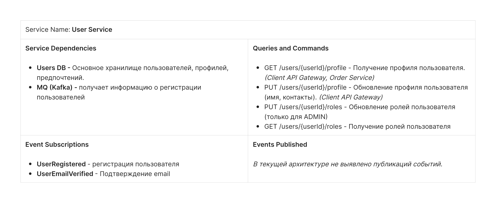

# Бизнес постановка
**Архитектурный кейс: "I'll Have the BLT" (Интернет-магазин сэндвичей)**

**Описание бизнеса:** Национальная сеть сэндвичных хочет модернизировать свою услугу "заказ по факсу", заменив ее (или дополнив) интернет-заказами.

**Пользователи:** Тысячи, а в перспективе — миллионы.

**Функциональные требования:**

1.  **Размещение заказа:** Пользователь должен иметь возможность оформить заказ.
2.  **Расчет времени и маршрута:** После оформления заказа система должна сообщить пользователю:
3.  Время, когда заказ будет готов к выдаче.
4.  Указания проезда до выбранного магазина с интеграцией с внешними картографическими сервисами (которые учитывают пробки).
5.  **Доставка:** Если магазин предоставляет услугу доставки, система должна направить водителя с заказом к пользователю.
6.  **Мобильность:** Система должна быть доступна и удобна для использования с мобильных устройств.
7.  **Акции:**
8.  Система должна предоставлять общенациональные ежедневные акции/спецпредложения.
9.  Система должна предоставлять локальные (для конкретного магазина) ежедневные акции/спецпредложения.
10.  **Оплата:** Система должна принимать оплату:
11.  Онлайн (при заказе).
12.  При получении (в магазине или курьеру при доставке).

**Бизнес-контекст и ограничения:**

1.  **Франчайзинг:** Магазины являются франшизами, и каждым владеет отдельный собственник.
2.  **Экспансия:** У головной компании есть планы по расширению на международный рынок в ближайшем будущем.
3.  **Труд:** Корпоративная цель — нанимать дешевую рабочую силу для максимизации прибыли.


# Пользовательские сценарии (BDD Format)

## Сценарии пользователя

### Аутентификация

#### Сценарий U-01-01: Регистрация нового пользователя

**Как новый пользователь Я хочу** зарегистрироваться в приложении **Чтобы** сохранить историю заказов и получать персональные акции.

**Сценарий:**

1.  **Дано** что пользователь открыл приложение впервые
2.  **Когда** он нажимает "Зарегистрироваться"
3.  **И** вводит email и пароль
4.  **И** подтверждает email через ссылку в письме
5.  **Тогда** система создает учетную запись
6.  **И** пользователь переходит на страницу авторизации

#### Сценарий U-01-02: Авторизация пользователя

**Как** зарегистрированный пользователь **Я хочу** войти в свой аккаунт **Чтобы** сделать заказ и увидеть историю заказов.

**Сценарий:**

1.  **Дано** что пользователь имеет учетную запись
2.  **Когда** он вводит email и пароль на экране входа
3.  **И** нажимает "Войти"
4.  **Тогда** система проверяет credentials
5.  **И** при успешной проверке открывает главный экран приложения
6.  **И** система предлагает выбрать магазин для заказа

#### Сценарий U-01-03: Восстановление пароля

**Как** пользователь забывший пароль **Я хочу** восстановить доступ к аккаунту **Чтобы** продолжить пользоваться приложением.

**Сценарий:**

1.  **Дано** что пользователь находится на экране входа
2.  **Когда** он нажимает "Забыли пароль?"
3.  **И** вводит свой email
4.  **Тогда** система отправляет письмо со ссылкой для сброса пароля
5.  **Когда** пользователь переходит по ссылке и вводит новый пароль
6.  **Тогда** система сохраняет новый пароль
7.  **И** переходит на страницу авторизации

### Выбор магазина

#### Сценарий U-02-01: Поиск магазина с учетом геолокации

**Как** мобильный пользователь с включенной геолокацией **Я хочу** выбрать магазин на карте **Чтобы** выбрать его для заказа.

**Сценарий:**

1.  **Дано** что у пользователя включена геолокация
2.  **Когда** он на главном экране переходит к выбору магазина для заказа
3.  **Тогда** система показывает ближайшие магазины к месту геолокации
4.  **И** показывает их текущий статус ("Открыто", "Закрыто")
5.  **И** сортирует их по расстоянию
6.  **И** показывает время пешком/на транспорте до каждого
7.  **И** предлагает выбрать магазин

#### Сценарий U-02-02: Выбор города вручную

**Как** пользователь с отключенной геолокацией или на десктопе **Я хочу** выбрать город вручную **Чтобы** увидеть магазины в нужном мне городе.

**Сценарий:**

1.  **Дано** что геолокация недоступна или пользователь на ПК
2.  **Когда** он открывает приложение
3.  **Тогда** система показывает поле "Выберите город"
4.  **Когда** пользователь вводит "Москва"
5.  **Тогда** система показывает все магазины в Москве
6.  **И** показывает их текущий статус ("Открыто", "Закрыто")
7.  **И** предлагает выбрать магазин

### Формирование заказа

#### Сценарий U-03-01: Просмотр меню с акциями и наличием

**Как** пользователь **Я хочу** увидеть меню, акции и наличие товаров выбранного магазина **Чтобы** понять что я могу заказать и по каким ценам.

**Сценарий:**

1.  **Дано** что пользователь выбрал магазин "Сэндвичная №42"
2.  **Когда** он переходит в раздел "Меню"
3.  **Тогда** система отображает доступные позиции с ценами
4.  **И** автоматически применяет все релевантные акции к ценам
5.  **И** показывает итоговую цену со скидкой
6.  **И** помечает товары "Нет в наличии" серым цветом
7.  **И** не позволяет добавить отсутствующие товары в корзину

#### Сценарий U-03-02: Просмотр карточки товара

**Как** пользователь **Я хочу** видеть детальную информацию о товаре **Чтобы** принять осознанное решение о покупке.

**Сценарий:**

1.  **Дано** что пользователь просматривает меню магазина
2.  **Когда** он нажимает на карточку товара " Сыр&ветчина сэндвич"
3.  **Тогда** система открывает детальную карточку товара с:

1.      Изображением

2.      Полным названием

3.      Подробным описанием состава

4.      Пищевой ценностью

5.      Аллергенами

6.      Исходной ценой

7.      Ценой со скидкой (если есть акция)

4.      **И** кнопку "Добавить в корзину" (если товар в наличии)

#### Сценарий U-03-03: Добавление товара в корзину

**Как** пользователь **Я хочу** добавить выбранный товар в корзину **Чтобы** в дальнейшем оформить заказ.

**Сценарий:**

1.  **Дано** что пользователь просматривает меню или карточку товара
2.  **Когда** он нажимает "Добавить в корзину" для сэндвича "Сыр&ветчина"
3.  **И** указывает количество
4.  **Тогда** товар добавляется в корзину
5.  **И** отображается счетчик товаров в корзине
6.  **И** автоматически применяются все релевантные акции к заказу

#### Сценарий U-03-04: Выбор доставки (внешний сервис)

**Как** пользователь **Я хочу** выбрать доставку через внешний сервис **Чтобы** получить заказ по указанному адресу.

**Сценарий:**

1.  **Дано** что в корзине есть товары
2.  **Когда** пользователь переходит к оформлению
3.  **И** выбирает "Доставка"
4.  **Тогда** система запрашивает адрес доставки
5.  **И** система проверяет наличие всех товаров
6.  **И** передает данные во внешний сервис доставки
7.  **И** показывает стоимость и время доставки от сервиса
8.  **И** показывает полную стоимость заказа с учетом доставки
9.  **И** предлагает подтвердить заказ

#### Сценарий U-03-05: Выбор самовывоза

**Как** пользователь **Я хочу** выбрать самовывоз **Чтобы** забрать заказ самостоятельно.

**Сценарий:**

1.  **Дано** что пользователь выбрал самовывоз из магазина "Сэндвичная №42"
2.  **Когда** пользователь переходит к оформлению
3.  **И** выбирает "Самовывоз"
4.  **Тогда** система проверяет наличие всех товаров
5.  **И** предлагает подтвердить заказ

#### Сценарий U-03-06: Оплата заказа онлайн

**Как** пользователь **Я хочу** оплатить заказ картой онлайн **Чтобы** не платить наличными при получении.

**Сценарий:**

1.  **Дано** что пользователь заполнил все данные заказа
2.  **И** выбрал один из способов получения
3.  **Когда** он выбирает "Оплата картой онлайн"
4.  **И** вводит валидные данные карты
5.  **И** подтверждает оплату
6.  **Тогда** система проводит платеж через платежный шлюз
7.  **И** при успешной оплате создает заказ
8.  **И** отправляет заказ в выбранный магазин
9.  **И** помечает заказ как «Оплачено»

#### Сценарий U-03-07: Оформление заказа с оплатой при получении

**Как** пользователь **Я хочу** оформить заказ с оплатой при получении **Чтобы** оплатить наличными или картой при получении.

**Сценарий:**

1.  **Дано** что пользователь заполнил все данные заказа
2.  **И** выбрал один из способов получения
3.  **Когда** он выбирает "Оплата при получении"
4.  **И** подтверждает заказ
5.  **Тогда** система создает заказ без списания платежа
6.  **И** отправляет заказ в выбранный магазин
7.  **И** помечает заказ как "Ожидает оплаты при получении"

#### Сценарий U-03-08: Получение подтверждения заказа

**Как** пользователь

**Я хочу** получить подтверждение что мой заказ принят

**Чтобы** быть уверенным что заказ поступил в работу.

**Сценарий:**

1.  **Дано** что пользователь завершил оформление заказа
2.  **Когда** система обработала заказ
3.  **Тогда** она показывает экран подтверждения с номером заказа
4.  **И** отправляет push-уведомление с деталями заказа
5.  **И** показывает время готовности/доставки

### История заказов

#### Сценарий U-04-01: Просмотр истории заказов

**Как** авторизованный пользователь **Я хочу** видеть историю своих заказов **Чтобы** отслеживать свои предыдущие покупки.

**Сценарий:**

1.  **Дано** что пользователь авторизован в системе
2.  **Когда** он переходит в раздел "История заказов"
3.  **Тогда** система отображает список заказов
4.  **И** для каждого заказа показывает:

1.       Номер заказа

2.       Дата и время заказа

3.       Магазин

4.       Состав заказа

5.       Итоговую сумму

6.       Статус заказа

5.  **И** сортирует заказы от новых к старым

#### Сценарий U-04-02: Просмотр деталей заказа

**Как** пользователь **Я хочу** видеть полную информацию о конкретном заказе **Чтобы** вспомнить, что было заказано ранее.

**Сценарий:**

1.  **Дано** что пользователь находится в истории заказов
2.  **Когда** он нажимает на номер заказа "#12345"
3.  **Тогда** система открывает детальную страницу заказа с:

1.       Полным составом заказа с ценами

2.       Информацией о магазине/доставке

3.       Временем создания и выполнения

4.       Статусом выполнения

5.       Способом оплаты и статусом оплаты

## Сценарии для менеджера магазина

#### Сценарий M\-01-01: Авторизация менеджера магазина

**Как** менеджер магазина **Я хочу** войти в систему управления магазином **Чтобы** управлять наличием товаров и заказами.

**Сценарий:**

1.  **Дано** что менеджер имеет учетную запись своего магазина
2.  **Когда** он вводит логин и пароль на экране входа
3.  **И** нажимает "Войти"
4.  **Тогда** система проверяет credentials
5.  **И** при успешной проверке открывает главный экран приложения

#### Сценарий M-01-02: Управление наличием товаров

**Как** менеджер магазина **Я хочу** обновлять наличие бутербродов **Чтобы** клиенты видели только доступные позиции.

**Сценарий:**

1.  **Дано** что менеджер авторизован
2.  **Когда** он отмечает "BLT сэндвич" как "Нет в наличии"
3.  **Тогда** система скрывает эту позицию для выбранного магазина
4.  **И** пользователи не могут добавить ее в корзину для этого магазина

#### Сценарий M-01-03: Создание локальных акций

**Как** менеджер магазина **Я хочу** создавать акции для моего магазина **Чтобы** привлекать клиентов.

**Сценарий:**

1.  **Дано** что менеджер в разделе "Акции"
2.  **Когда** он создает акцию "Скидка 20% на сэндвич Сыр&Ветчина"
3.  **Тогда** акция автоматически применяется к ценам в его магазине
4.  **И** пользователи видят цены со скидкой при выборе этого магазина

#### Сценарий M-01-04: Просмотр заказов магазина

**Как** менеджер магазина **Я хочу** видеть заказы моего магазина **Чтобы** готовить их к выдаче.

**Сценарий:**

1.  **Дано** что менеджер авторизован
2.  **Когда** он открывает "Текущие заказы"
3.  **Тогда** система показывает заказы для его магазина, которые необходимо собрать, с данными:

1.       Полным составом заказа с ценами

2.       Информацией о магазине/доставке

3.       Временем создания и выполнения

4.       Статусом выполнения

5.       Способом оплаты и статусом оплаты

#### Сценарий M-01-05: Отметка заказа как готового

**Как** менеджер магазина **Я хочу** отмечать заказы как готовые к выдаче  **Чтобы** клиенты знали когда можно забирать заказ

**Сценарий:**

1.  **Дано** **что менеджер авторизован**
2.  **Когда** **он открывает "Текущие заказы"**
3.  **Тогда** **система показывает заказы для его магазина**
4.  **И для каждого заказ отображает, с данными:**
1.  **Полным составом заказа с ценами**
2.  **Информацией о магазине/доставке**
3.  **Временем создания и выполнения**
4.  **Статусом выполнения**
5.  **Способом оплаты и статусом оплаты**
5.  **И** позволяет отметить заказ как "Готов к выдаче**"**

#### Сценарий M-01-05: Отметка заказа как выданного

**Как** менеджер магазина **Я хочу** отмечать заказы которые выданы **Чтобы** сохранять информацию о завершенных заказах

**Сценарий:**

1.  **Дано** что менеджер авторизован
2.  **Когда** он открывает "Текущие заказы"
3.  **Тогда** система показывает заказы для его магазина
4.  **И** позволяет отметить заказ как "Выдан"

## Сценарии для администратора сети франшизы

#### Сценарий A-01-01: Аутентификация

**Как** администратор сети франшизы **Я хочу** войти в управление сетей  **Чтобы** управлять функциями сети

**Сценарий:**

1.  **Дано** что администратор имеет учетную запись
2.  **Когда** он вводит логин и пароль на экране входа
3.  **И** нажимает "Войти"
4.  **Тогда** система проверяет credentials
5.  **И** при успешной проверке открывает главный экран приложения

#### Сценарий A-01-02: Управление каталогом товаров

**Как** администратор сети **Я хочу** управлять общим каталогом **Чтобы** стандартизировать меню.

**Сценарий:**

1.  **Дано** что администратор в разделе "Каталог"
2.  **Когда** он добавляет новый товар "Веганский сэндвич"
3.  **Тогда** товар становится доступен всем магазинам
4.  **И** менеджеры магазинов могут управлять его наличием

#### Сценарий A-01-03: Создание сетевых акций

**Как** администратор сети. **Я хочу** создавать акции для всех магазинов. **Чтобы** проводить общие кампании.

**Сценарий:**

1.  **Дано** что администратор создает акцию
2.  **Когда** он устанавливает "Для всех магазинов"
3.  **Тогда** акция автоматически применяется ко всем магазинам
4.  **И** пользователи видят цены со скидкой во всех магазинах

#### Сценарий A-01-04: Управление магазинами сети

**Как** администратор сети **Я хочу** добавлять новые магазины **Чтобы** расширять сеть.

**Сценарий:**

1.  **Дано** что администратор добавляет магазин
2.  **Когда** он заполняет данные и назначает менеджера
3.  **Тогда** магазин появляется в поиске
4.  **И** может принимать заказы
5.  **И формируется уникальный логин и пароль для менеджера магазина****.**

# Контейнерная диаграмма


# Описание и назначение сервисов

## Auth Service

**Назначение:** Центр аутентификации и управления доступом

**Зона ответственности:**

1.  **Регистрация новых пользователей** - валидация email, создание учетной записи
2.  **Аутентификация** - проверка логина/пароля, выдача JWT-токенов
3.  **Управление сессиями** - refresh-токены, инвалидация сессий
4.  **Восстановление доступа** - сброс пароля через email
5.  **Верификация email** - отправка и проверка confirmation-токенов
6.  **Валидация токенов** для API Gateway и внутренних сервисов

**Ключевые данные:** JWT-токены, сессии, временные токены верификации


## User Service

**Назначение:** **Агрегирует информацию** о пользователях

**Зона ответственности:**

1.  **Хранение учетных данных** - email, хеши паролей (bcrypt)
2.  **Профили пользователей** - имена, контакты, дата рождения

**Ключевые данные:** Полные профили пользователей


## Shop Service

**Назначение:** Управление физическими точками сети

**Зона ответственности:**

1.  **Данные магазинов** - названия, адреса, координаты, телефоны
2.  **Геопоиск** - поиск магазинов в радиусе, расчет расстояний
3.  **Расписание работы** - ежедневное расписание, праздничные дни
4.  **Статусы магазинов** - открыт/закрыт, технические перерывы
5.  **Интеграция с Maps API** - геокодирование, расчет маршрутов

**Ключевые данные:** Локации магазинов, расписания, геоданные

## Catalog Service

**Назначение:** Центр управления товарами и ценами

**Зона ответственности:**

1.  **Каталог товаров** - названия, описания, составы, аллергены, изображения
2.  **Ценообразование** - базовые цены + применение акций
3.  **Управление наличием** - остатки по магазинам
4.  **Резервирование товаров** - блокировка на время оформления заказа
5.  **Кэширование меню** - быстрый доступ к актуальным данным магазинов
6.  **Поиск и фильтрация** товаров

**Ключевые данные:** Товары, цены, наличие, резервы

## Cart Service

**Назначение:** Временное хранение корзин покупок

**Зона ответственности:**

1.  **Корзины пользователей** - хранение в Redis с TTL
2.  **Добавление/удаление товаров** - с валидацией цен и наличия
3.  **Расчет итогов** - промежуточные суммы
4.  **Автоочистка** - удаление старых корзин
5.  **Восстановление корзин** при повторном входе

**Ключевые данные:** Временные корзины, выбранные товары

## Promotion Service

**Назначение:** Управление системой скидок и акций

**Зона ответственности:**

1.  **Глобальные акции** - действуют для всей сети
2.  **Локальные акции** - только для конкретных магазинов
3.  **Валидация сроков** - автоматическая активация/деактивация
4.  **Предоставление акций** для Catalog Service

**Ключевые данные:** Акции, условия

## Order Service

**Назначение:** Оркестратор процесса заказа

**Зона ответственности:**

1.  **Создание заказов** - координация между всеми сервисами
2.  **Валидация заказов** - проверка наличия, цен, доступности
3.  **Управление статусами** – принят, готовится, готов, выдан, доставляется
4.  **История заказов** - полная информация о всех заказах
5.  **Интеграция процессов** - резервирование, оплата, доставка

**Ключевые данные:** Заказы, статусы

## Delivery Service

**Назначение:** Адаптер для служб доставки

**Зона ответственности:**

1.  **Интеграция с API доставки** - создание заказов доставки
2.  **Обработка отмен** - отмена доставки при отмене заказа
3.  **Уведомление о статусах** - трансляция изменений в систему

**Ключевые данные:** Заказы доставки, статусы, курьеры

## Payment Service

**Назначение:** Единая точка интеграции с платежными системами

**Зона ответственности:**

1.  **Поддержка платежных шлюзов**.

**Ключевые данные:** Платежи, транзакции, статусы оплат

## Notification Service

**Назначение:** Централизованная система уведомлений

**Зона ответственности:**

1.  **Отправка оповещений**

**Ключевые данные:** Оповещения


# Контракты
## Auth Service Contracts

### 1. REST API Endpoints
#### POST /auth/register
**Description:** Регистрация нового пользователя
```json
{
  "email": "user@example.com",
  "password": "securePassword123",
  "profile": {
    "firstName": "John",
    "lastName": "Doe",
    "phone": "+1234567890",
    "roles": ["CUSTOMER"]
  }
}
```

**Response:**
```json
{
  "userId": "a1b2c3d4-e5f6-7890-abcd-ef1234567890",
  "status": "PENDING_VERIFICATION",
  "message": "Verification email sent",
  "roles": ["CUSTOMER"]
}
```

#### POST /auth/login
**Description:** Аутентификация пользователя
```json
{
  "email": "user@example.com",
  "password": "securePassword123"
}
```

**Response:**
```json
{
  "accessToken": "jwt-token",
  "refreshToken": "refresh-token",
  "expiresIn": 3600,
  "userId": "a1b2c3d4-e5f6-7890-abcd-ef1234567890"
}
```

#### POST /auth/logout
**Description:** Инвалидация токенов
**Headers:** Authorization: Bearer {token}

**Response:**
```json
{
  "success": true,
  "message": "Successfully logged out"
}
```

#### POST /auth/password-reset
**Description:** Инициация сброса пароля
```json
{
  "email": "user@example.com"
}
```

**Response:**
```json
{
  "success": true,
  "message": "Password reset email sent"
}
```

#### POST /auth/validate
**Description:** Валидация JWT токена
**Headers:** Authorization: Bearer {token}

**Response:**
```json
{
  "valid": true,
  "userId": "uuid",
  "roles": ["CUSTOMER"]
}
```

### 2. Internal Service Calls

#### User Service Integration
**Endpoint:** POST /users/authenticate (internal)
```json
{
  "email": "user@example.com",
  "password": "securePassword123"
}
```

**Response:**
```json
{
  "authenticated": true,
  "userId": "a1b2c3d4-e5f6-7890-abcd-ef1234567890",
  "userProfile": {
    "email": "user@example.com",
    "firstName": "John",
    "lastName": "Doe",
    "phone": "+1234567890",
    "roles": ["CUSTOMER"]
  }
}
```

### 3. Error Responses
```json
{
  "error": "INVALID_CREDENTIALS",
  "message": "Invalid email or password",
  "timestamp": "2024-01-15T10:30:00Z"
}
```

### 4. External Integrations

#### Email Service
**Protocol:** SMTP
**Templates:**
- Email Verification
- Password Reset

Понял! Восстанавливаю полный формат с описаниями.

## User Service Contracts

### 1. REST API Endpoints

#### POST /users/register
**Description:** Создание пользователя (вызывается Auth Service)
```json
{
  "email": "user@example.com",
  "passwordHash": "hashed_password_123",
  "profile": {
    "firstName": "John",
    "lastName": "Doe", 
    "phone": "+1234567890"
  },
  "roles": ["CUSTOMER"]
}
```

**Response:**
```json
{
  "userId": "a1b2c3d4-e5f6-7890-abcd-ef1234567890",
  "status": "CREATED",
  "email": "user@example.com",
  "roles": ["CUSTOMER"]
}
```

или вариант для ADMIN при создании Manager 
```json
{
  "email": "user@example.com",
  "passwordHash": "hashed_password_123",
  "profile": {
    "firstName": "John",
    "lastName": "Doe", 
    "phone": "+1234567890"
  },
  "roles": ["SHOP_MANAGER"],
  "shopId": "b2c3d4e5-f6g7-8901-bcde-f23456789012"
}
```
**Response:**
```json
{
  "userId": "a1b2c3d4-e5f6-7890-abcd-ef1234567890",
  "status": "CREATED",
  "email": "user@example.com",
  "roles": ["SHOP_MANAGER"],
  "shopId": "b2c3d4e5-f6g7-8901-bcde-f23456789012"
}
```

#### POST /users/authenticate
**Description:** Проверка учетных данных (вызывается Auth Service)
```json
{
  "email": "user@example.com",
  "password": "plain_password_123"
}
```

**Response:**
```json
{
  "authenticated": true,
  "userId": "a1b2c3d4-e5f6-7890-abcd-ef1234567890",
  "userProfile": {
    "email": "user@example.com",
    "firstName": "John",
    "lastName": "Doe",
    "phone": "+1234567890"
  },
  "roles": ["CUSTOMER"]
}
```

#### GET /users/{userId}
**Description:** Получение профиля пользователя
**Headers:** Authorization: Bearer {token}

**Response:**
```json
{
  "userId": "a1b2c3d4-e5f6-7890-abcd-ef1234567890",
  "email": "user@example.com",
  "profile": {
    "firstName": "John",
    "lastName": "Doe",
    "phone": "+1234567890"
  },
  "roles": ["CUSTOMER"],
  "createdAt": "2024-01-15T10:30:00Z",
  "status": "ACTIVE"
}
```

#### PUT /users/{userId}/profile
**Description:** Обновление профиля пользователя
**Headers:** Authorization: Bearer {token}
```json
{
  "firstName": "John",
  "lastName": "Smith",
  "phone": "+1987654321"
}
```

**Response:**
```json
{
  "success": true,
  "userId": "a1b2c3d4-e5f6-7890-abcd-ef1234567890"
}
```

#### POST /users/password-reset
**Description:** Обновление пароля (вызывается Auth Service)
```json
{
  "userId": "a1b2c3d4-e5f6-7890-abcd-ef1234567890",
  "newPasswordHash": "new_hashed_password"
}
```

**Response:**
```json
{
  "success": true,
  "userId": "a1b2c3d4-e5f6-7890-abcd-ef1234567890",
  "passwordUpdatedAt": "2024-01-15T10:35:00Z"
}
```

#### PUT /users/{userId}/roles
**Description:** Обновление ролей пользователя (только для ADMIN)
**Headers:** Authorization: Bearer {token}
```json
{
  "roles": ["SHOP_MANAGER"],
  "shopId": "b2c3d4e5-f6g7-8901-bcde-f23456789012"
}
```

**Response:**
```json
{
  "success": true,
  "userId": "a1b2c3d4-e5f6-7890-abcd-ef1234567890",
  "updatedRoles": ["SHOP_MANAGER"],
  "assignedShopId": "b2c3d4e5-f6g7-8901-bcde-f23456789012"
}
```

#### GET /users/{userId}/roles
**Description:** Получение ролей пользователя
**Headers:** Authorization: Bearer {token}

**Response:**
```json
{
  "userId": "a1b2c3d4-e5f6-7890-abcd-ef1234567890",
  "roles": ["SHOP_MANAGER"],
  "assignedShopId": "b2c3d4e5-f6g7-8901-bcde-f23456789012",
  "permissions": ["MANAGE_ORDERS", "MANAGE_INVENTORY", "CREATE_PROMOTIONS"]
}
```

### 2. Error Responses
```json
{
  "error": "USER_NOT_FOUND",
  "message": "User with specified ID not found",
  "timestamp": "2024-01-15T10:30:00Z"
}
```

```json
{
  "error": "EMAIL_ALREADY_EXISTS",
  "message": "User with this email already registered", 
  "timestamp": "2024-01-15T10:30:00Z"
}
```

```json
{
  "error": "INVALID_PROFILE_DATA",
  "message": "Provided profile data is invalid",
  "timestamp": "2024-01-15T10:30:00Z"
}
```

```json
{
  "error": "INSUFFICIENT_PERMISSIONS",
  "message": "User does not have required permissions",
  "timestamp": "2024-01-15T10:30:00Z"
}
```

```json
{
  "error": "MANAGER_ALREADY_ASSIGNED",
  "message": "Shop already has a manager assigned",
  "timestamp": "2024-01-15T10:30:00Z"
}
```
---

Отлично! Переходим к **Shop Service**.

## Shop Service Contracts

### 1. REST API Endpoints

#### GET /shops/nearby
**Description:** Поиск магазинов рядом с локацией
**Headers:** Authorization: Bearer {token}
**Query Parameters:**
- `latitude` (required): 55.7558
- `longitude` (required): 37.6173
- `radius` (optional): 5000 (meters)
- `limit` (optional): 10

**Response:**
```json
{
  "shops": [
    {
      "shopId": "b2c3d4e5-f6g7-8901-bcde-f23456789012",
      "name": "Сэндвичная №42",
      "address": "ул. Примерная, 123",
      "coordinates": {
        "latitude": 55.7558,
        "longitude": 37.6173
      },
      "status": "OPEN",
      "openingHours": {
        "monday": {"open": "09:00", "close": "22:00"},
        "tuesday": {"open": "09:00", "close": "22:00"},
        "sunday": {"open": "10:00", "close": "20:00"}
      },
      "contact": {
        "phone": "+74951234567",
        "email": "shop42@blt.com"
      },
      "services": ["SELF_PICKUP", "DELIVERY"],
      "distance": 350,
      "estimatedTravelTime": "5 минут пешком"
    }
  ],
  "totalCount": 1,
  "searchRadius": 5000
}
```

#### GET /shops/{shopId}
**Description:** Получение детальной информации о магазине
**Headers:** Authorization: Bearer {token}

**Response:**
```json
{
  "shopId": "b2c3d4e5-f6g7-8901-bcde-f23456789012",
  "name": "Сэндвичная №42",
  "description": "Лучшие сэндвичи в городе",
  "address": {
    "street": "ул. Примерная, 123",
    "city": "Москва",
    "postalCode": "123456",
    "country": "Россия"
  },
  "coordinates": {
    "latitude": 55.7558,
    "longitude": 37.6173
  },
  "status": "OPEN",
  "openingHours": {
    "monday": {"open": "09:00", "close": "22:00"},
    "tuesday": {"open": "09:00", "close": "22:00"},
    "sunday": {"open": "10:00", "close": "20:00"}
  },
  "contact": {
    "phone": "+74951234567",
    "email": "shop42@blt.com"
  },
  "services": ["SELF_PICKUP", "DELIVERY"],
  "createdAt": "2024-01-01T00:00:00Z",
  "updatedAt": "2024-01-15T10:30:00Z"
}
```

#### POST /shops
**Description:** Добавление нового магазина в сеть (только ADMIN)
**Headers:** Authorization: Bearer {token}
```json
{
  "name": "Сэндвичная №43",
  "description": "Новый магазин в центре",
  "address": {
    "street": "ул. Новая, 45",
    "city": "Москва", 
    "postalCode": "123457",
    "country": "Россия"
  },
  "coordinates": {
    "latitude": 55.7600,
    "longitude": 37.6200
  },
  "openingHours": {
    "monday": {"open": "09:00", "close": "22:00"},
    "tuesday": {"open": "09:00", "close": "22:00"}
  },
  "contact": {
    "phone": "+74957654321",
    "email": "shop43@blt.com"
  },
  "services": ["SELF_PICKUP", "DELIVERY"]
}
```

**Response:**
```json
{
  "success": true,
  "shopId": "c3d4e5f6-g7h8-9012-cdef-345678901234",
  "name": "Сэндвичная №43",
  "status": "CREATED"
}
```

#### PUT /shops/{shopId}
**Description:** Обновление данных магазина
**Headers:** Authorization: Bearer {token}
```json
{
  "name": "Сэндвичная №42 (обновленная)",
  "description": "Обновленное описание магазина",
  "openingHours": {
    "monday": {"open": "08:00", "close": "23:00"}
  },
  "contact": {
    "phone": "+74959876543"
  }
}
```

**Response:**
```json
{
  "success": true,
  "shopId": "b2c3d4e5-f6g7-8901-bcde-f23456789012",
  "updatedFields": ["name", "description", "openingHours", "contact"],
  "updatedAt": "2024-01-15T11:00:00Z"
}
```

#### PUT /shops/{shopId}/status
**Description:** Изменение статуса магазина
**Headers:** Authorization: Bearer {token}
```json
{
  "status": "CLOSED",
  "reason": "Технические работы"
}
```

**Response:**
```json
{
  "success": true,
  "shopId": "b2c3d4e5-f6g7-8901-bcde-f23456789012",
  "previousStatus": "OPEN",
  "newStatus": "CLOSED",
  "reason": "Технические работы",
  "changedAt": "2024-01-15T11:00:00Z"
}
```

### 2. Error Responses
```json
{
  "error": "SHOP_NOT_FOUND",
  "message": "Shop with specified ID not found",
  "timestamp": "2024-01-15T10:30:00Z"
}
```

```json
{
  "error": "INVALID_COORDINATES",
  "message": "Provided coordinates are invalid",
  "timestamp": "2024-01-15T10:30:00Z"
}
```

```json
{
  "error": "SHOP_ALREADY_EXISTS",
  "message": "Shop with this address already exists",
  "timestamp": "2024-01-15T10:30:00Z"
}
```

```json
{
  "error": "INVALID_OPENING_HOURS", 
  "message": "Provided opening hours are invalid",
  "timestamp": "2024-01-15T10:30:00Z"
}
```

---
