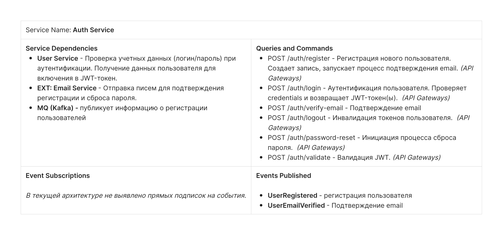
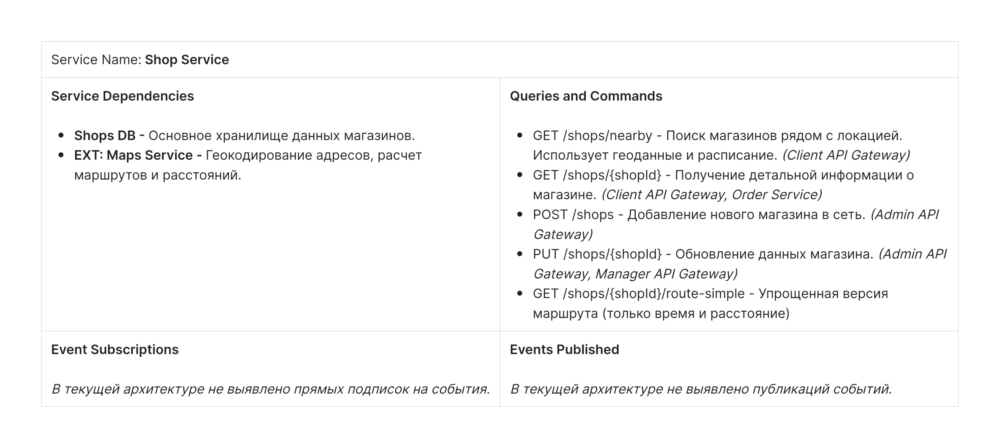
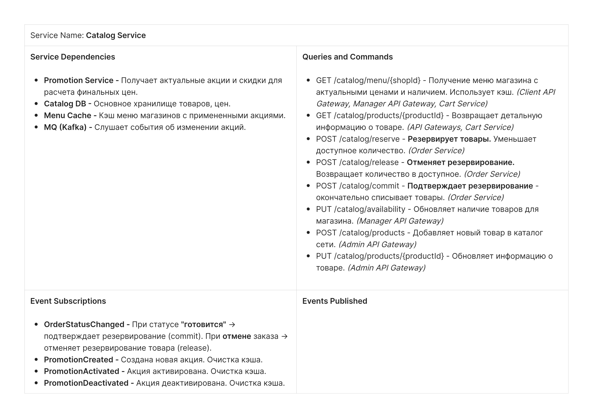
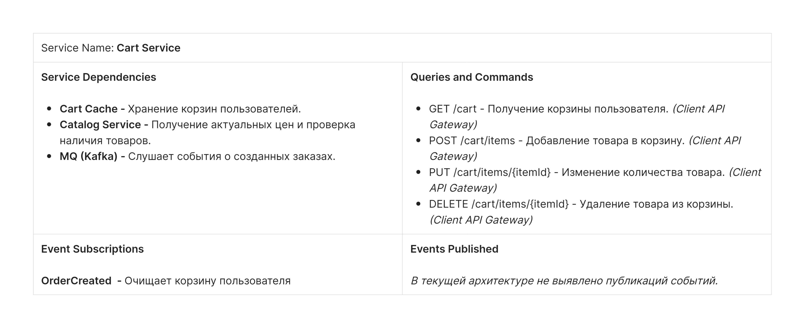
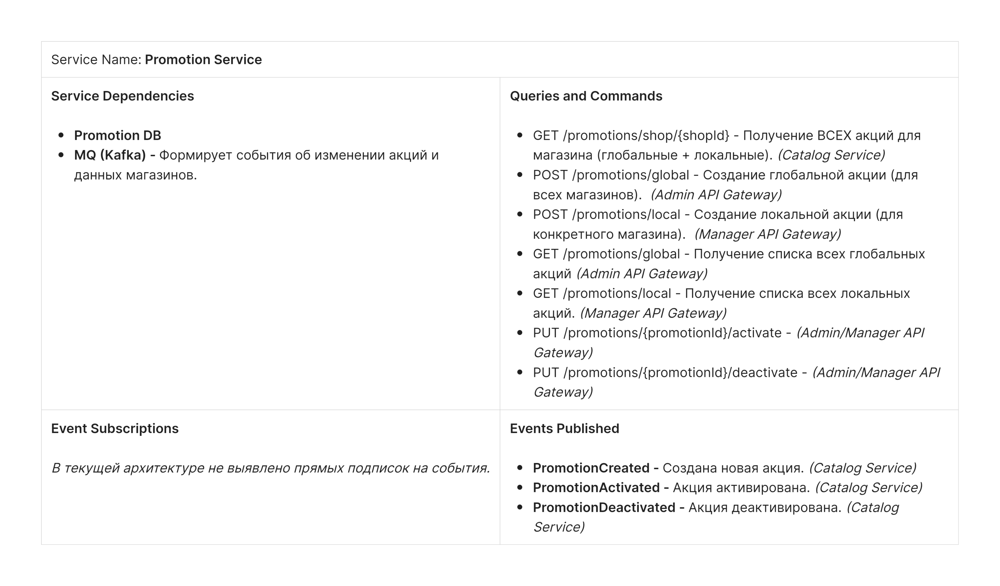
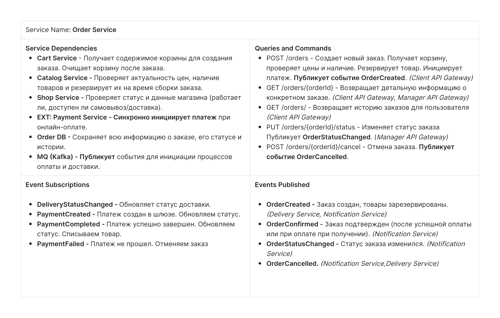
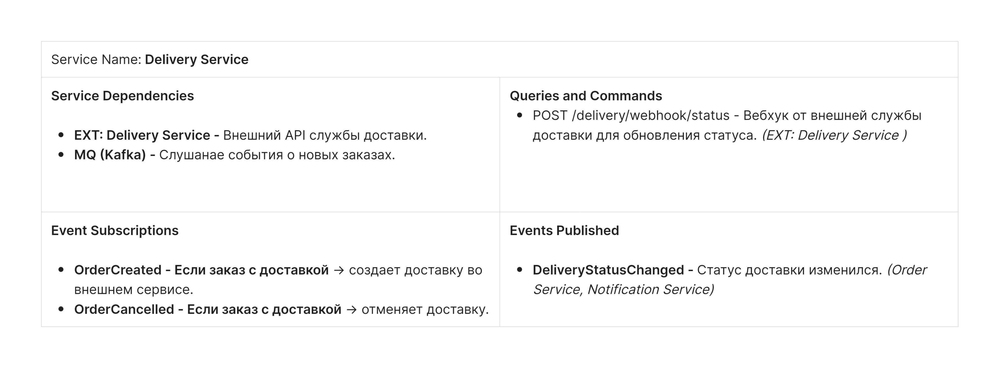
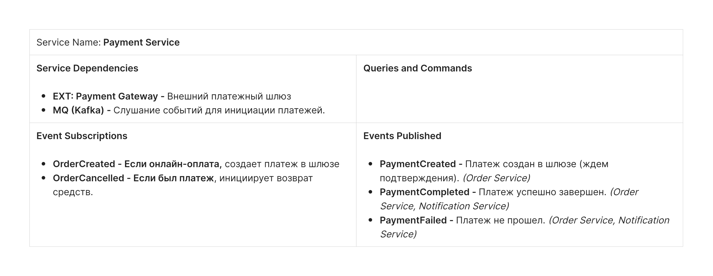
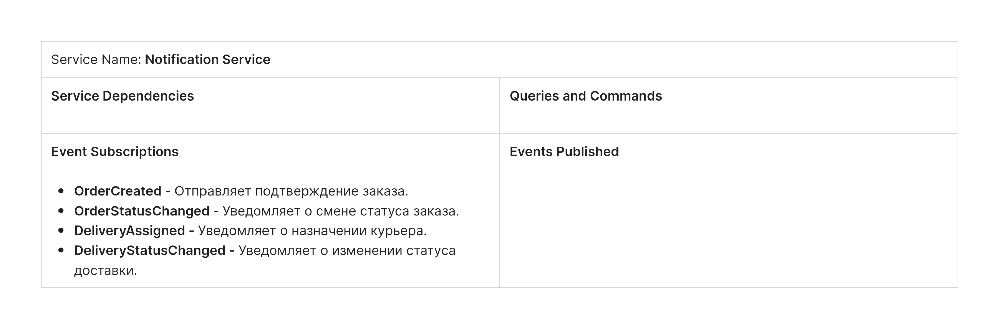

# Бизнес постановка
**Архитектурный кейс: "I'll Have the BLT" (Интернет-магазин сэндвичей)**

**Описание бизнеса:** Национальная сеть сэндвичных хочет модернизировать свою услугу "заказ по факсу", заменив ее (или дополнив) интернет-заказами.

**Пользователи:** Тысячи, а в перспективе — миллионы.

**Функциональные требования:**

1. **Размещение заказа:** Пользователь должен иметь возможность оформить заказ.
2. **Расчет времени и маршрута:** После оформления заказа система должна сообщить пользователю:
   1. Время, когда заказ будет готов к выдаче.
   2. Указания проезда до выбранного магазина с интеграцией с внешними картографическими сервисами (которые учитывают пробки).
3. **Доставка:** Если магазин предоставляет услугу доставки, система должна направить водителя с заказом к пользователю.
4. **Мобильность:** Система должна быть доступна и удобна для использования с мобильных устройств.
5. **Акции:**
   1. Система должна предоставлять общенациональные ежедневные акции/спецпредложения.
   2. Система должна предоставлять локальные (для конкретного магазина) ежедневные акции/спецпредложения.
6.  **Оплата:** Система должна принимать оплату:
7.  Онлайн (при заказе).
8.  При получении (в магазине или курьеру при доставке).

**Бизнес-контекст и ограничения:**

1.  **Франчайзинг:** Магазины являются франшизами, и каждым владеет отдельный собственник.
2.  **Экспансия:** У головной компании есть планы по расширению на международный рынок в ближайшем будущем.
3.  **Труд:** Корпоративная цель — нанимать дешевую рабочую силу для максимизации прибыли.


# Пользовательские сценарии (BDD Format)

## Сценарии пользователя

### Аутентификация

#### Сценарий U-01-01: Регистрация нового пользователя

**Как новый пользователь Я хочу** зарегистрироваться в приложении **Чтобы** сохранить историю заказов и получать персональные акции.

**Сценарий:**

1.  **Дано** что пользователь открыл приложение впервые
2.  **Когда** он нажимает "Зарегистрироваться"
3.  **И** вводит email и пароль
4.  **И** подтверждает email через ссылку в письме
5.  **Тогда** система создает учетную запись
6.  **И** пользователь переходит на страницу авторизации

#### Сценарий U-01-02: Авторизация пользователя

**Как** зарегистрированный пользователь **Я хочу** войти в свой аккаунт **Чтобы** сделать заказ и увидеть историю заказов.

**Сценарий:**

1.  **Дано** что пользователь имеет учетную запись
2.  **Когда** он вводит email и пароль на экране входа
3.  **И** нажимает "Войти"
4.  **Тогда** система проверяет credentials
5.  **И** при успешной проверке открывает главный экран приложения
6.  **И** система предлагает выбрать магазин для заказа

#### Сценарий U-01-03: Восстановление пароля

**Как** пользователь забывший пароль **Я хочу** восстановить доступ к аккаунту **Чтобы** продолжить пользоваться приложением.

**Сценарий:**

1.  **Дано** что пользователь находится на экране входа
2.  **Когда** он нажимает "Забыли пароль?"
3.  **И** вводит свой email
4.  **Тогда** система отправляет письмо со ссылкой для сброса пароля
5.  **Когда** пользователь переходит по ссылке и вводит новый пароль
6.  **Тогда** система сохраняет новый пароль
7.  **И** переходит на страницу авторизации

### Выбор магазина

#### Сценарий U-02-01: Поиск магазина с учетом геолокации

**Как** мобильный пользователь с включенной геолокацией **Я хочу** выбрать магазин на карте **Чтобы** выбрать его для заказа.

**Сценарий:**

1.  **Дано** что у пользователя включена геолокация
2.  **Когда** он на главном экране переходит к выбору магазина для заказа
3.  **Тогда** система показывает ближайшие магазины к месту геолокации
4.  **И** показывает их текущий статус ("Открыто", "Закрыто")
5.  **И** сортирует их по расстоянию
6.  **И** показывает время пешком/на транспорте до каждого
7.  **И** предлагает выбрать магазин

#### Сценарий U-02-02: Выбор города вручную

**Как** пользователь с отключенной геолокацией или на десктопе **Я хочу** выбрать город вручную **Чтобы** увидеть магазины в нужном мне городе.

**Сценарий:**

1.  **Дано** что геолокация недоступна или пользователь на ПК
2.  **Когда** он открывает приложение
3.  **Тогда** система показывает поле "Выберите город"
4.  **Когда** пользователь вводит "Москва"
5.  **Тогда** система показывает все магазины в Москве
6.  **И** показывает их текущий статус ("Открыто", "Закрыто")
7.  **И** предлагает выбрать магазин

#### Сценарий U-02-03: Получение маршрута до магазина

**Как** пользователь выбравший магазин **Я хочу** увидеть маршрут от моего местоположения до магазина **Чтобы** понять как добраться и сколько времени займет.

**Сценарий:**

1. **Дано** что пользователь выбрал магазин "Сэндвичная №42"
2. **И** у пользователя включена геолокация
3. **Когда** он нажимает "Как добраться"
4. **Тогда** система определяет текущее местоположение пользователя
5. **И** рассчитывает маршрут до выбранного магазина
6. **И** показывает:
    - Общее расстояние и время в пути
    - Пошаговые инструкции (опционально)
    - Примерное время прибытия

### Формирование заказа

#### Сценарий U-03-01: Просмотр меню с акциями и наличием

**Как** пользователь **Я хочу** увидеть меню, акции и наличие товаров выбранного магазина **Чтобы** понять что я могу заказать и по каким ценам.

**Сценарий:**

1.  **Дано** что пользователь выбрал магазин "Сэндвичная №42"
2.  **Когда** он переходит в раздел "Меню"
3.  **Тогда** система отображает доступные позиции с ценами
4.  **И** автоматически применяет все релевантные акции к ценам
5.  **И** показывает итоговую цену со скидкой
6.  **И** помечает товары "Нет в наличии" серым цветом
7.  **И** не позволяет добавить отсутствующие товары в корзину

#### Сценарий U-03-02: Просмотр карточки товара

**Как** пользователь **Я хочу** видеть детальную информацию о товаре **Чтобы** принять осознанное решение о покупке.

**Сценарий:**

1.  **Дано** что пользователь просматривает меню магазина
2.  **Когда** он нажимает на карточку товара " Сыр&ветчина сэндвич"
3.  **Тогда** система открывает детальную карточку товара с:
- Полным названием
- Подробным описанием состава
- Исходной ценой
- Ценой со скидкой (если есть акция)
4. **И** кнопку "Добавить в корзину" (если товар в наличии)

#### Сценарий U-03-03: Добавление товара в корзину

**Как** пользователь **Я хочу** добавить выбранный товар в корзину **Чтобы** в дальнейшем оформить заказ.

**Сценарий:**

1.  **Дано** что пользователь просматривает меню или карточку товара
2.  **Когда** он нажимает "Добавить в корзину" для сэндвича "Сыр&ветчина"
3.  **И** указывает количество
4.  **Тогда** товар добавляется в корзину
5.  **И** отображается счетчик товаров в корзине
6.  **И** автоматически применяются все релевантные акции к заказу

#### Сценарий U-03-04: Выбор доставки (внешний сервис)

**Как** пользователь **Я хочу** выбрать доставку через внешний сервис **Чтобы** получить заказ по указанному адресу.

**Сценарий:**

1.  **Дано** что в корзине есть товары
2.  **Когда** пользователь переходит к оформлению
3.  **И** выбирает "Доставка"
4.  **Тогда** система запрашивает адрес доставки
5.  **И** система проверяет наличие всех товаров
6.  **И** передает данные во внешний сервис доставки
7.  **И** показывает стоимость и время доставки от сервиса
8.  **И** показывает полную стоимость заказа с учетом доставки
9.  **И** предлагает подтвердить заказ

#### Сценарий U-03-05: Выбор самовывоза

**Как** пользователь **Я хочу** выбрать самовывоз **Чтобы** забрать заказ самостоятельно.

**Сценарий:**

1.  **Дано** что пользователь выбрал самовывоз из магазина "Сэндвичная №42"
2.  **Когда** пользователь переходит к оформлению
3.  **И** выбирает "Самовывоз"
4.  **Тогда** система проверяет наличие всех товаров
5.  **И** предлагает подтвердить заказ

#### Сценарий U-03-06: Оплата заказа онлайн

**Как** пользователь **Я хочу** оплатить заказ картой онлайн **Чтобы** не платить наличными при получении.

**Сценарий:**

1.  **Дано** что пользователь заполнил все данные заказа
2.  **И** выбрал один из способов получения
3.  **Когда** он выбирает "Оплата картой онлайн"
4.  **И** вводит валидные данные карты
5.  **И** подтверждает оплату
6.  **Тогда** система проводит платеж через платежный шлюз
7.  **И** при успешной оплате создает заказ
8.  **И** отправляет заказ в выбранный магазин
9.  **И** помечает заказ как «Оплачено»

#### Сценарий U-03-07: Оформление заказа с оплатой при получении

**Как** пользователь **Я хочу** оформить заказ с оплатой при получении **Чтобы** оплатить наличными или картой при получении.

**Сценарий:**

1.  **Дано** что пользователь заполнил все данные заказа
2.  **И** выбрал один из способов получения
3.  **Когда** он выбирает "Оплата при получении"
4.  **И** подтверждает заказ
5.  **Тогда** система создает заказ без списания платежа
6.  **И** отправляет заказ в выбранный магазин
7.  **И** помечает заказ как "Ожидает оплаты при получении"

#### Сценарий U-03-08: Получение подтверждения заказа

**Как** пользователь

**Я хочу** получить подтверждение что мой заказ принят

**Чтобы** быть уверенным что заказ поступил в работу.

**Сценарий:**

1.  **Дано** что пользователь завершил оформление заказа
2.  **Когда** система обработала заказ
3.  **Тогда** она показывает экран подтверждения с номером заказа
4.  **И** отправляет push-уведомление с деталями заказа
5.  **И** показывает время готовности/доставки

### История заказов

#### Сценарий U-04-01: Просмотр истории заказов

**Как** авторизованный пользователь **Я хочу** видеть историю своих заказов **Чтобы** отслеживать свои предыдущие покупки.

**Сценарий:**

1. **Дано** что пользователь авторизован в системе
2. **Когда** он переходит в раздел "История заказов"
3. **Тогда** система отображает список заказов
4. **И** для каждого заказа показывает:
   1. Номер заказа
   2. Дата и время заказа
   3. Магазин
   4. Состав заказа
   5. Итоговую сумму
   6. Статус заказа
5.  **И** сортирует заказы от новых к старым


#### Сценарий U-04-02: Просмотр деталей заказа

**Как** пользователь **Я хочу** видеть полную информацию о конкретном заказе **Чтобы** вспомнить, что было заказано ранее.

**Сценарий:**

1. **Дано** что пользователь находится в истории заказов
2. **Когда** он нажимает на номер заказа "#12345"
3. **Тогда** система открывает детальную страницу заказа с:
   1. Полным составом заказа с ценами
   2. Информацией о магазине/доставке
   3. Временем создания и выполнения
   4. Статусом выполнения
   5. Способом оплаты и статусом оплаты

## Сценарии для менеджера магазина

#### Сценарий M-01-01: Авторизация менеджера магазина

**Как** менеджер магазина **Я хочу** войти в систему управления магазином **Чтобы** управлять наличием товаров и заказами.

**Сценарий:**

1.  **Дано** что менеджер имеет учетную запись связанную с магазином
2.  **Когда** он вводит логин и пароль на экране входа
3.  **И** нажимает "Войти"
4.  **Тогда** система проверяет credentials
5.  **И** при успешной проверке открывает главный экран приложения

#### Сценарий M-01-02: Управление наличием товаров

**Как** менеджер магазина **Я хочу** обновлять наличие бутербродов **Чтобы** клиенты видели только доступные позиции.

**Сценарий:**

1.  **Дано** что менеджер авторизован
2.  **Когда** он отмечает "BLT сэндвич" как "Нет в наличии"
3.  **Тогда** система скрывает эту позицию для выбранного магазина
4.  **И** пользователи не могут добавить ее в корзину для этого магазина

#### Сценарий M-01-03: Создание локальных акций

**Как** менеджер магазина **Я хочу** создавать акции для моего магазина **Чтобы** привлекать клиентов.

**Сценарий:**

1.  **Дано** что менеджер в разделе "Акции"
2.  **Когда** он создает акцию "Скидка 20% на сэндвич Сыр&Ветчина"
3.  **Тогда** акция автоматически применяется к ценам в его магазине
4.  **И** пользователи видят цены со скидкой при выборе этого магазина

#### Сценарий M-01-04: Просмотр заказов магазина

**Как** менеджер магазина **Я хочу** видеть заказы моего магазина **Чтобы** готовить их к выдаче.

**Сценарий:**

1. **Дано** что менеджер авторизован
2. **Когда** он открывает "Текущие заказы"
3. **Тогда** система показывает заказы для его магазина, которые необходимо собрать, с данными:
   1. Полным составом заказа с ценами
   2. Информацией о магазине/доставке
   3. Временем создания и выполнения
   4. Статусом выполнения
   5. Способом оплаты и статусом оплаты

#### Сценарий M-01-05: Отметка заказа как готового

**Как** менеджер магазина **Я хочу** отмечать заказы как готовые к выдаче **Чтобы** клиенты знали когда можно забирать заказ

**Сценарий:**

1. **Дано** **что менеджер авторизован**
2. **Когда** **он открывает "Текущие заказы"**
3. **Тогда** **система показывает заказы для его магазина**
4. **И для каждого заказ отображает, с данными:**
   1. **Полным составом заказа с ценами**
   2. **Информацией о магазине/доставке**
   3. **Временем создания и выполнения**
   4. **Статусом выполнения**
   5. **Способом оплаты и статусом оплаты**
5. **И** позволяет отметить заказ как "Готов к выдаче"

#### Сценарий M-01-06: Отметка заказа как выданного

**Как** менеджер магазина **Я хочу** отмечать заказы которые выданы **Чтобы** сохранять информацию о завершенных заказах

**Сценарий:**

1.  **Дано** что менеджер авторизован
2.  **Когда** он открывает "Текущие заказы"
3.  **Тогда** система показывает заказы для его магазина
4.  **И** позволяет отметить заказ как "Завершен"

## Сценарии для администратора сети франшизы

#### Сценарий A-01-01: Аутентификация

**Как** администратор сети франшизы **Я хочу** войти в управление сетей **Чтобы** управлять функциями сети

**Сценарий:**

1.  **Дано** что администратор имеет учетную запись
2.  **Когда** он вводит логин и пароль на экране входа
3.  **И** нажимает "Войти"
4.  **Тогда** система проверяет credentials
5.  **И** при успешной проверке открывает главный экран приложения

#### Сценарий A-01-02: Управление каталогом товаров

**Как** администратор сети **Я хочу** управлять общим каталогом **Чтобы** стандартизировать меню.

**Сценарий:**

1.  **Дано** что администратор в разделе "Каталог"
2.  **Когда** он добавляет новый товар "Веганский сэндвич"
3.  **Тогда** товар становится доступен всем магазинам
4.  **И** менеджеры магазинов могут управлять его наличием

#### Сценарий A-01-03: Создание сетевых акций

**Как** администратор сети. **Я хочу** создавать акции для всех магазинов. **Чтобы** проводить общие кампании.

**Сценарий:**

1.  **Дано** что администратор создает акцию
2.  **Когда** он устанавливает "Для всех магазинов"
3.  **Тогда** акция автоматически применяется ко всем магазинам
4.  **И** пользователи видят цены со скидкой во всех магазинах

#### Сценарий A-01-04: Управление магазинами сети

**Как** администратор сети **Я хочу** добавлять новые магазины **Чтобы** расширять сеть.

**Сценарий:**

1.  **Дано** что администратор добавляет магазин
2.  **Когда** он сохраняет данные нового магазина
3.  **Тогда** магазин появляется в поиске
4.  **И** может принимать заказы

#### Сценарий A-01-05: Назначение менеджера магазина

**Как** администратор сети **Я хочу** назначить пользователю роль менеджера магазина **Чтобы** делегировать управление конкретным магазином.

**Сценарий:**

1.  **Дано** что администратор авторизован в системе
2.  **Когда** он переходит в раздел "Менеджеры магазинов"
3.  **И** выбирает существующего пользователя из списка
4.  **И** назначает ему роль "SHOP_MANAGER"
5.  **И** привязывает его к конкретному магазину
6.  **Тогда** пользователь получает доступ к системе управления магазином

# Контейнерная диаграмма


# Описание и назначение сервисов

## Auth Service

**Назначение:** Центр аутентификации и управления доступом

**Зона ответственности:**

1.  **Регистрация новых пользователей** - валидация email, создание учетной записи
2.  **Аутентификация** - проверка логина/пароля, выдача JWT-токенов
3.  **Управление сессиями** - refresh-токены, инвалидация сессий
4.  **Восстановление доступа** - сброс пароля через email
5.  **Верификация email** - отправка и проверка confirmation-токенов
6.  **Валидация токенов** для API Gateway и внутренних сервисов

**Ключевые данные:** Учетные данные, сессии, JWT-токены, временные токены


## User Service

**Назначение:** Управление профилями пользователей, ролями и настройками

**Зона ответственности:**
1. **Профили пользователей** - имена, контакты, дата рождения, настройки
2. **Управление ролями** - назначение ролей (CUSTOMER, SHOP_MANAGER, ADMIN)
3. **Привязка менеджеров к магазинам** - связь пользователь-магазин для менеджеров
4. **Обработка событий** - создание и обновление профилей на основе событий Auth Service
5. **Предоставление профилей** для других сервисов

**Ключевые данные:** Полные профили пользователей


## Shop Service

**Назначение:** Управление физическими точками сети

**Зона ответственности:**

1.  **Данные магазинов** - названия, адреса, координаты, телефоны
2.  **Геопоиск** - поиск магазинов в радиусе, расчет расстояний
3.  **Расписание работы** - ежедневное расписание, праздничные дни
4.  **Статусы магазинов** - открыт/закрыт, технические перерывы
5.  **Интеграция с Maps API** - геокодирование, расчет маршрутов
6.  **Расчет маршрутов** - получение направления от пользователя до магазина

**Ключевые данные:** Локации магазинов, расписания, геоданные


## Catalog Service

**Назначение:** Центр управления товарами и ценами

**Зона ответственности:**

1.  **Каталог товаров** - названия, описания, составы, аллергены, изображения
2.  **Ценообразование** - базовые цены + применение акций
3.  **Управление наличием** - остатки по магазинам
4.  **Резервирование товаров** - блокировка на время оформления заказа
5.  **Кэширование меню** - быстрый доступ к актуальным данным магазинов
6.  **Поиск и фильтрация** товаров

**Ключевые данные:** Товары, цены, наличие, резервы


## Cart Service

**Назначение:** Временное хранение корзин покупок

**Зона ответственности:**

1.  **Корзины пользователей** - хранение в Redis с TTL
2.  **Добавление/удаление товаров** - с валидацией цен и наличия
3.  **Расчет итогов** - промежуточные суммы
4.  **Автоочистка** - удаление старых корзин
5.  **Восстановление корзин** при повторном входе

**Ключевые данные:** Временные корзины, выбранные товары


## Promotion Service

**Назначение:** Управление системой скидок и акций

**Зона ответственности:**

1.  **Глобальные акции** - действуют для всей сети
2.  **Локальные акции** - только для конкретных магазинов
3.  **Валидация сроков** - автоматическая активация/деактивация
4.  **Предоставление акций** для Catalog Service

**Ключевые данные:** Акции, условия


## Order Service

**Назначение:** Оркестратор процесса заказа

**Зона ответственности:**

1.  **Создание заказов** - координация между всеми сервисами
2.  **Валидация заказов** - проверка наличия, цен, доступности
3.  **Управление статусами** – принят, готовится, готов, выдан, доставляется
4.  **История заказов** - полная информация о всех заказах
5.  **Интеграция процессов** - резервирование, оплата, доставка

**Ключевые данные:** Заказы, статусы


## Delivery Service

**Назначение:** Адаптер для служб доставки

**Зона ответственности:**

1.  **Интеграция с API доставки** - создание заказов доставки
2.  **Обработка отмен** - отмена доставки при отмене заказа
3.  **Уведомление о статусах** - трансляция изменений в систему

**Ключевые данные:** Заказы доставки, статусы, курьеры


## Payment Service

**Назначение:** Единая точка интеграции с платежными системами

**Зона ответственности:**

- Поддержка платежных шлюзов

**Ключевые данные:** Платежи, транзакции, статусы оплат


## Notification Service

**Назначение:** Централизованная система уведомлений

**Зона ответственности:**

1.  **Отправка оповещений**

**Ключевые данные:** Оповещения



# Контракты
## Auth Service Contracts

### 1. REST API Endpoints

#### POST /auth/register
**Description:** Регистрация нового пользователя
```json
{
  "email": "user@example.com",
  "password": "securePassword123",
  "profile": {
    "firstName": "John",
    "lastName": "Doe",
    "phone": "+1234567890"
  }
}
```

**Response:**
```json
{
  "userId": "a1b2c3d4-e5f6-7890-abcd-ef1234567890",
  "status": "PENDING_VERIFICATION",
  "message": "Registration successful. Please check your email for verification."
}
```

#### POST /auth/login
**Description:** Аутентификация пользователя
```json
{
  "email": "user@example.com",
  "password": "securePassword123"
}
```

**Response:**
```json
{
  "accessToken": "jwt-token",
  "refreshToken": "refresh-token",
  "expiresIn": 3600,
  "userId": "a1b2c3d4-e5f6-7890-abcd-ef1234567890"
}
```

#### POST /auth/verify-email
**Description:** Подтверждение email
```json
{
  "token": "email-verification-token"
}
```

**Response:**
```json
{
  "success": true,
  "message": "Email successfully verified"
}
```

#### POST /auth/password-reset
**Description:** Инициация сброса пароля
```json
{
  "email": "user@example.com"
}
```

**Response:**
```json
{
  "success": true,
  "message": "Password reset email sent"
}
```

#### POST /auth/validate
**Description:** Валидация JWT токена
**Headers:** Authorization: Bearer {token}

**Response:**
```json
{
  "valid": true,
  "userId": "a1b2c3d4-e5f6-7890-abcd-ef1234567890",
  "email": "user@example.com"
}
```

### 2. Events Published (Auth Service публикует)

#### UserRegistered
```json
{
  "eventType": "UserRegistered",
  "eventId": "evt_123456789",
  "userId": "a1b2c3d4-e5f6-7890-abcd-ef1234567890",
  "email": "user@example.com",
  "profile": {
    "firstName": "John",
    "lastName": "Doe",
    "phone": "+1234567890"
  },
  "timestamp": "2024-01-15T10:30:00Z"
}
```

#### UserEmailVerified
```json
{
  "eventType": "UserEmailVerified",
  "eventId": "evt_123456790",
  "userId": "a1b2c3d4-e5f6-7890-abcd-ef1234567890",
  "email": "user@example.com",
  "verifiedAt": "2024-01-15T10:35:00Z"
}
```
---

## User Service Contracts

### 1. REST API Endpoints

#### GET /users/{userId}/profile
**Description:** Получение профиля пользователя
**Headers:** Authorization: Bearer {token}

**Response:**
```json
{
  "userId": "a1b2c3d4-e5f6-7890-abcd-ef1234567890",
  "email": "user@example.com",
  "profile": {
    "firstName": "John",
    "lastName": "Doe",
    "phone": "+1234567890",
    "dateOfBirth": "1990-01-01"
  },
  "roles": ["CUSTOMER"],
  "emailVerified": true,
  "createdAt": "2024-01-15T10:30:00Z",
  "updatedAt": "2024-01-15T10:35:00Z"
}
```

#### PUT /users/{userId}/profile
**Description:** Обновление профиля пользователя
**Headers:** Authorization: Bearer {token}
```json
{
  "firstName": "John",
  "lastName": "Smith",
  "phone": "+1987654321",
  "dateOfBirth": "1990-01-01"
}
```

**Response:**
```json
{
  "success": true,
  "userId": "a1b2c3d4-e5f6-7890-abcd-ef1234567890"
}
```


#### PUT /users/{userId}/roles
**Description:** Обновление ролей пользователя (только для ADMIN)
**Headers:** Authorization: Bearer {token}
```json
{
  "roles": ["SHOP_MANAGER"],
  "shopId": "b2c3d4e5-f6g7-8901-bcde-f23456789012"
}
```

**Response:**
```json
{
  "success": true,
  "userId": "a1b2c3d4-e5f6-7890-abcd-ef1234567890",
  "updatedRoles": ["SHOP_MANAGER"],
  "assignedShopId": "b2c3d4e5-f6g7-8901-bcde-f23456789012"
}
```

#### GET /users/{userId}/roles
**Description:** Получение ролей пользователя
**Headers:** Authorization: Bearer {token}

**Response:**
```json
{
  "userId": "a1b2c3d4-e5f6-7890-abcd-ef1234567890",
  "roles": ["SHOP_MANAGER"],
  "assignedShopId": "b2c3d4e5-f6g7-8901-bcde-f23456789012"
}
```

### 2. Event Subscriptions (User Service подписывается на)

#### UserRegistered
```json
{
  "eventType": "UserRegistered",
  "eventId": "evt_123456789",
  "userId": "a1b2c3d4-e5f6-7890-abcd-ef1234567890",
  "email": "user@example.com",
  "profile": {
    "firstName": "John",
    "lastName": "Doe",
    "phone": "+1234567890"
  },
  "timestamp": "2024-01-15T10:30:00Z"
}
```
- **User Service Action:** Создает профиль пользователя с полученными данными

#### UserEmailVerified
```json
{
  "eventType": "UserEmailVerified",
  "eventId": "evt_123456790",
  "userId": "a1b2c3d4-e5f6-7890-abcd-ef1234567890",
  "email": "user@example.com",
  "verifiedAt": "2024-01-15T10:35:00Z"
}
```
- **User Service Action:** Обновляет статус `emailVerified` в профиле пользователя

---

## Shop Service Contracts

### 1. REST API Endpoints

#### GET /shops/nearby
**Description:** Поиск магазинов рядом с локацией
**Headers:** Authorization: Bearer {token}
**Query Parameters:**
- `latitude` (required): 55.7558
- `longitude` (required): 37.6173
- `radius` (optional): 5000 (meters)
- `limit` (optional): 10

**Response:**
```json
{
  "shops": [
    {
      "shopId": "b2c3d4e5-f6g7-8901-bcde-f23456789012",
      "name": "Сэндвичная №42",
      "address": "ул. Примерная, 123",
      "coordinates": {
        "latitude": 55.7558,
        "longitude": 37.6173
      },
      "status": "OPEN",
      "openingHours": {
        "monday": {"open": "09:00", "close": "22:00"},
        "tuesday": {"open": "09:00", "close": "22:00"},
        "sunday": {"open": "10:00", "close": "20:00"}
      },
      "contact": {
        "phone": "+74951234567",
        "email": "shop42@blt.com"
      },
      "services": ["SELF_PICKUP", "DELIVERY"],
      "distance": 350,
      "estimatedTravelTime": "5 минут пешком"
    }
  ],
  "totalCount": 1,
  "searchRadius": 5000
}
```

#### GET /shops/{shopId}
**Description:** Получение детальной информации о магазине
**Headers:** Authorization: Bearer {token}

**Response:**
```json
{
  "shopId": "b2c3d4e5-f6g7-8901-bcde-f23456789012",
  "name": "Сэндвичная №42",
  "description": "Лучшие сэндвичи в городе",
  "address": {
    "street": "ул. Примерная, 123",
    "city": "Москва",
    "postalCode": "123456",
    "country": "Россия"
  },
  "coordinates": {
    "latitude": 55.7558,
    "longitude": 37.6173
  },
  "status": "OPEN",
  "openingHours": {
    "monday": {"open": "09:00", "close": "22:00"},
    "tuesday": {"open": "09:00", "close": "22:00"},
    "sunday": {"open": "10:00", "close": "20:00"}
  },
  "contact": {
    "phone": "+74951234567",
    "email": "shop42@blt.com"
  },
  "services": ["SELF_PICKUP", "DELIVERY"],
  "createdAt": "2024-01-01T00:00:00Z",
  "updatedAt": "2024-01-15T10:30:00Z"
}
```

#### POST /shops
**Description:** Добавление нового магазина в сеть (только ADMIN)
**Headers:** Authorization: Bearer {token}
```json
{
  "name": "Сэндвичная №43",
  "description": "Новый магазин в центре",
  "address": {
    "street": "ул. Новая, 45",
    "city": "Москва", 
    "postalCode": "123457",
    "country": "Россия"
  },
  "coordinates": {
    "latitude": 55.7600,
    "longitude": 37.6200
  },
  "openingHours": {
    "monday": {"open": "09:00", "close": "22:00"},
    "tuesday": {"open": "09:00", "close": "22:00"}
  },
  "contact": {
    "phone": "+74957654321",
    "email": "shop43@blt.com"
  },
  "services": ["SELF_PICKUP", "DELIVERY"]
}
```

**Response:**
```json
{
  "success": true,
  "shopId": "c3d4e5f6-g7h8-9012-cdef-345678901234",
  "name": "Сэндвичная №43",
  "status": "CREATED"
}
```

#### PUT /shops/{shopId}
**Description:** Обновление данных магазина
**Headers:** Authorization: Bearer {token}
```json
{
  "name": "Сэндвичная №42 (обновленная)",
  "description": "Обновленное описание магазина",
  "openingHours": {
    "monday": {"open": "08:00", "close": "23:00"}
  },
  "contact": {
    "phone": "+74959876543"
  }
}
```

**Response:**
```json
{
  "success": true,
  "shopId": "b2c3d4e5-f6g7-8901-bcde-f23456789012",
  "updatedFields": ["name", "description", "openingHours", "contact"],
  "updatedAt": "2024-01-15T11:00:00Z"
}
```

#### PUT /shops/{shopId}/status
**Description:** Изменение статуса магазина
**Headers:** Authorization: Bearer {token}
```json
{
  "status": "CLOSED",
  "reason": "Технические работы"
}
```

**Response:**
```json
{
  "success": true,
  "shopId": "b2c3d4e5-f6g7-8901-bcde-f23456789012",
  "previousStatus": "OPEN",
  "newStatus": "CLOSED",
  "reason": "Технические работы",
  "changedAt": "2024-01-15T11:00:00Z"
}
```

#### GET /shops/{shopId}/route-simple
**Description:** Упрощенная версия маршрута (только время и расстояние)
**Headers:** Authorization: Bearer {token}
**Query Parameters:**
- `userLatitude` (required): 55.7558
- `userLongitude` (required): 37.6173
- `travelMode` (optional): `walking`, `driving`, `transit` (default: walking)

**Response:**
```json
{
  "shopId": "b2c3d4e5-f6g7-8901-bcde-f23456789012",
  "distance": "850 м",
  "duration": "10 минут",
  "travelMode": "walking",
  "estimatedArrivalTime": "2024-01-15T11:45:00Z"
}
```

### 2. Error Responses
```json
{
  "error": "SHOP_NOT_FOUND",
  "message": "Shop with specified ID not found",
  "timestamp": "2024-01-15T10:30:00Z"
}
```

```json
{
  "error": "INVALID_COORDINATES",
  "message": "Provided coordinates are invalid",
  "timestamp": "2024-01-15T10:30:00Z"
}
```

```json
{
  "error": "SHOP_ALREADY_EXISTS",
  "message": "Shop with this address already exists",
  "timestamp": "2024-01-15T10:30:00Z"
}
```

```json
{
  "error": "INVALID_OPENING_HOURS", 
  "message": "Provided opening hours are invalid",
  "timestamp": "2024-01-15T10:30:00Z"
}
```
---

## Catalog Service Contracts

### 1. REST API Endpoints

#### GET /catalog/menu/{shopId}
**Description:** Получение меню магазина с актуальными ценами и наличием
**Headers:** Authorization: Bearer {token}

**Response:**
```json
{
  "shopId": "b2c3d4e5-f6g7-8901-bcde-f23456789012",
  "shopName": "Сэндвичная №42",
  "items": [
    {
      "productId": "e5f6g7h8-i9j0-1234-efgh-567890123456",
      "name": "BLT Сэндвич",
      "originalPrice": 350.00,
      "finalPrice": 280.00,
      "discount": {
        "discountId": "d5e6f7g8-h9i0-2345-ghij-789012345678",
        "scope": "LOCAL",
        "type": "PERCENTAGE",
        "value": 20
      },
      "available": true,
      "availableQuantity": 15
    }
  ],
  "lastUpdated": "2024-01-15T10:30:00Z"
}
```

#### GET /catalog/products/{productId}
**Description:** Получение детальной информации о товаре
**Headers:** Authorization: Bearer {token}

**Response:**
```json
{
  "productId": "e5f6g7h8-i9j0-1234-efgh-567890123456",
  "name": "BLT Сэндвич",
  "description": "Классический сэндвич с хрустящим беконом, свежим салатом и сочными помидорами",
  "basePrice": 350.00,
  "available": true,
  "availableQuantity": 15,
  "ingredients": ["Бекон", "Салат Айсберг", "Помидоры", "Белый хлеб", "Майонез"]
}
```

#### POST /catalog/reserve
**Description:** Резервирование товаров на время сборки заказа
**Headers:** 
- Authorization: Bearer {token}
- Idempotency-Key: ik_reserve_123456789 (REQUIRED)
```json
{
  "orderId": "c3d4e5f6-g7h8-9012-cdef-345678901234",
  "shopId": "b2c3d4e5-f6g7-8901-bcde-f23456789012",
  "items": [
    {
      "productId": "e5f6g7h8-i9j0-1234-efgh-567890123456",
      "quantity": 2
    }
  ]
}
```

**Response:**
```json
{
  "success": true,
  "reservationId": "res_123456789",
  "idempotencyKey": "ik_reserve_123456789"
}
```

#### POST /catalog/release
**Description:** Отмена резервирования товаров
**Headers:** Authorization: Bearer {token}
```json
{
  "reservationId": "res_123456789"
}
```

**Response:**
```json
{
  "success": true,
  "reservationId": "res_123456789"
}
```

#### POST /catalog/commit
**Description:** Подтверждение резервирования - окончательное списание товаров
**Headers:** 
- Authorization: Bearer {token}
- Idempotency-Key: ik_commit_123456789 (REQUIRED)
```json
{
  "reservationId": "res_123456789"
}
```

**Response:**
```json
{
  "success": true,
  "reservationId": "res_123456789"
}
```

#### PUT /catalog/availability
**Description:** Обновление наличия товаров для магазина
**Headers:** Authorization: Bearer {token}
```json
{
  "shopId": "b2c3d4e5-f6g7-8901-bcde-f23456789012",
  "availabilityUpdates": [
    {
      "productId": "e5f6g7h8-i9j0-1234-efgh-567890123456",
      "availableQuantity": 5
    }
  ]
}
```

**Response:**
```json
{
  "success": true,
  "shopId": "b2c3d4e5-f6g7-8901-bcde-f23456789012",
  "updatedItems": [
    {
      "productId": "e5f6g7h8-i9j0-1234-efgh-567890123456",
      "available": true,
      "availableQuantity": 5,
      "previousAvailability": false
    }
  ]
}
```

#### POST /catalog/products
**Description:** Добавление нового товара в каталог сети (ADMIN only)
**Headers:** Authorization: Bearer {token}
```json
{
  "name": "Веганский сэндвич",
  "description": "Сэндвич с овощами и тофу",
  "basePrice": 320.00,
  "ingredients": ["Тофу", "Огурцы", "Помидоры", "Салат", "Веганский майонез"]
}
```

**Response:**
```json
{
  "success": true,
  "productId": "f6g7h8i9-j0k1-2345-fghi-678901234567",
  "name": "Веганский сэндвич",
  "status": "CREATED"
}
```

### 2. Error Responses
```json
{
  "error": "PRODUCT_NOT_FOUND",
  "message": "Product with specified ID not found",
  "timestamp": "2024-01-15T10:30:00Z"
}
```

```json
{
  "error": "INSUFFICIENT_STOCK",
  "message": "Not enough stock available for reservation",
  "timestamp": "2024-01-15T10:30:00Z"
}
```

```json
{
  "error": "RESERVATION_EXPIRED",
  "message": "Product reservation has expired",
  "timestamp": "2024-01-15T10:30:00Z"
}
```

---


### 3. Event Subscriptions (Catalog Service подписывается на)

#### OrderStatusChanged
**Description:** При изменении статуса заказа
```json
{
  "eventType": "OrderStatusChanged",
  "eventId": "evt_123456789",
  "orderId": "c3d4e5f6-g7h8-9012-cdef-345678901234",
  "previousStatus": "CREATED",
  "newStatus": "PREPARING",
  "timestamp": "2024-01-15T10:30:00Z"
}
```

- **Catalog Service Action:** 
  - При статусе "PREPARING" → подтверждает резервирование (commit). 
  - При "CANCELLED" → отменяет резервирование (release).

#### PromotionCreated
**Description:** Создана новая акция
```json
{
  "eventType": "PromotionCreated",
  "eventId": "evt_123456789",
  "promotionId": "d5e6f7g8-h9i0-2345-ghij-789012345678",
  "scope": "GLOBAL",
  "productIds": ["e5f6g7h8-i9j0-1234-efgh-567890123456"],
  "timestamp": "2024-01-15T10:30:00Z"
}
```
- **Catalog Service Action:** Очищает кэш меню для affected магазинов.

#### PromotionActivated
**Description:** Акция активирована
```json
{
  "eventType": "PromotionActivated",
  "eventId": "evt_123456789",
  "promotionId": "d5e6f7g8-h9i0-2345-ghij-789012345678",
  "scope": "LOCAL",
  "shopId": "b2c3d4e5-f6g7-8901-bcde-f23456789012",
  "timestamp": "2024-01-15T10:30:00Z"
}
```
- **Catalog Service Action:** Очищает кэш меню для affected магазинов.

#### PromotionDeactivated
**Description:** Акция деактивирована
```json
{
  "eventType": "PromotionDeactivated",
  "eventId": "evt_123456789",
  "promotionId": "d5e6f7g8-h9i0-2345-ghij-789012345678",
  "scope": "GLOBAL",
  "timestamp": "2024-01-15T10:30:00Z"
}
```
---

## Cart Service Contracts

### 1. REST API Endpoints

#### GET /cart
**Description:** Получение корзины пользователя
**Headers:** Authorization: Bearer {token}

**Response:**
```json
{
  "cartId": "cart_123456789",
  "userId": "a1b2c3d4-e5f6-7890-abcd-ef1234567890",
  "shopId": "b2c3d4e5-f6g7-8901-bcde-f23456789012",
  "items": [
    {
      "cartItemId": "item_123456",
      "productId": "e5f6g7h8-i9j0-1234-efgh-567890123456",
      "name": "BLT Сэндвич",
      "quantity": 2,
      "unitPrice": 280.00,
      "totalPrice": 560.00
    }
  ],
  "summary": {
    "cartTotalPrice": 560.00,
    "itemCount": 2
  },
  "createdAt": "2024-01-15T10:00:00Z",
  "updatedAt": "2024-01-15T10:30:00Z"
}
```
- Наличие корзины по другому магазину приводит к очистке ее

#### POST /cart/items
**Description:** Добавление товара в корзину
**Headers:** Authorization: Bearer {token}
```json
{
  "shopId": "b2c3d4e5-f6g7-8901-bcde-f23456789012",
  "productId": "e5f6g7h8-i9j0-1234-efgh-567890123456",
  "quantity": 2
}
```

**Response:**
```json
{
  "success": true,
  "shopId": "b2c3d4e5-f6g7-8901-bcde-f23456789012",
  "productId": "e5f6g7h8-i9j0-1234-efgh-567890123456",
  "cartItemId": "item_123456",
  "quantity": 2,
  "unitPrice": 280.00,
  "totalPrice": 560.00,
  "summary": {
    "cartTotalPrice": 560.00,
    "itemCount": 2
  }
}
```

#### PUT /cart/items/{cartItemId}
**Description:** Изменение количества товара в корзине
**Headers:** Authorization: Bearer {token}
```json
{
  "quantity": 3
}
```

**Response:**
```json
{
  "success": true,
  "cartItemId": "item_123456",
  "previousQuantity": 2,
  "newQuantity": 1,
  "unitPrice": 280.00,
  "totalPrice": 280.00,
  "summary": {
    "cartTotalPrice": 560.00,
    "itemCount": 2
  }
}
```

#### DELETE /cart/items/{cartItemId}
**Description:** Удаление товара из корзины
**Headers:** Authorization: Bearer {token}

**Response:**
```json
{
  "success": true,
  "removedItemId": "item_123456",
  "removedProduct": "BLT Сэндвич",
  "summary": {
    "cartTotalPrice": 280.00,
    "itemCount": 1
  }
}
```

#### POST /cart/clear
**Description:** Очистка всей корзины
**Headers:** Authorization: Bearer {token}

**Response:**
```json
{
  "success": true
}
```

### 2. Event Subscriptions (Cart Service подписывается на)

#### OrderCreated
**Description:** Заказ создан
```json
{
  "eventType": "OrderCreated",
  "eventId": "evt_123456789",
  "orderId": "c3d4e5f6-g7h8-9012-cdef-345678901234",
  "userId": "a1b2c3d4-e5f6-7890-abcd-ef1234567890",
  "shopId": "b2c3d4e5-f6g7-8901-bcde-f23456789012",
  "deliveryType": "DELIVERY",
  "paymentMethod": "ONLINE",
  "totalAmount": 560.00,
  "deliveryAddress": {
    "street": "ул. Примерная, 123",
    "city": "Москва"
  },
  "timestamp": "2024-01-15T10:30:00Z"
}
```

- **Cart Service Action:** Очищает корзину пользователя


**Cart Service Action:** Обновляет цены в корзинах

### 3. Events Published (Cart Service публикует)

#### CartUpdated
**Description:** Корзина была обновлена
```json
{
  "eventType": "CartUpdated",
  "eventId": "evt_123456789",
  "cartId": "cart_123456789",
  "userId": "a1b2c3d4-e5f6-7890-abcd-ef1234567890",
  "shopId": "b2c3d4e5-f6g7-8901-bcde-f23456789012",
  "itemCount": 3,
  "totalAmount": 946.00,
  "timestamp": "2024-01-15T10:30:00Z"
}
```

### 4. Error Responses
```json
{
  "error": "CART_NOT_FOUND",
  "message": "Cart for user not found",
  "timestamp": "2024-01-15T10:30:00Z"
}
```

```json
{
  "error": "PRODUCT_UNAVAILABLE",
  "message": "Product is not available in selected shop",
  "timestamp": "2024-01-15T10:30:00Z"
}
```

```json
{
  "error": "SHOP_CHANGE_NOT_ALLOWED",
  "message": "Cannot add products from different shops to the same cart",
  "timestamp": "2024-01-15T10:30:00Z"
}
```

```json
{
  "error": "MAX_QUANTITY_EXCEEDED",
  "message": "Maximum quantity per product exceeded",
  "timestamp": "2024-01-15T10:30:00Z"
}
```

---

## Order Service Contracts

### 1. REST API Endpoints

#### POST /orders
**Description:** Создание нового заказа
**Headers:** 
- Authorization: Bearer {token}
- Idempotency-Key: ik_order_123456789 (REQUIRED)
```json
{
  "userId": "a1b2c3d4-e5f6-7890-abcd-ef1234567890",
  "shopId": "b2c3d4e5-f6g7-8901-bcde-f23456789012",
  "deliveryType": "SELF_PICKUP", 
  "deliveryAddress": {
    "street": "ул. Примерная, 123",
    "city": "Москва",
    "postalCode": "123456",
    "apartment": "45"
  },
  "paymentMethod": "ONLINE",
  "items": [
    {
      "productId": "e5f6g7h8-i9j0-1234-efgh-567890123456",
      "quantity": 2,
      "unitPrice": 280.00
    }
  ],
  "customerNotes": "Пожалуйста, добавьте больше соуса"
}
```

**Response:**
```json
{
  "orderId": "c3d4e5f6-g7h8-9012-cdef-345678901234",
  "status": "CREATED",
  "estimatedReadyTime": "2024-01-15T11:30:00Z",
  "totalAmount": 560.00,
  "orderNumber": "BLT-001234",
  "idempotencyKey": "ik_order_123456789",
  "createdAt": "2024-01-15T10:30:00Z"
}
```

#### GET /orders/{orderId}
**Description:** Получение детальной информации о заказе
**Headers:** Authorization: Bearer {token}

**Response:**
```json
{
  "orderId": "c3d4e5f6-g7h8-9012-cdef-345678901234",
  "orderNumber": "BLT-001234",
  "userId": "a1b2c3d4-e5f6-7890-abcd-ef1234567890",
  "shopId": "b2c3d4e5-f6g7-8901-bcde-f23456789012",
  "shopName": "Сэндвичная №42",
  "status": "PREPARING",
  "deliveryType": "SELF_PICKUP",
  "deliveryAddress": {
    "street": "ул. Примерная, 123",
    "city": "Москва",
    "postalCode": "123456"
  },
  "paymentMethod": "ONLINE",
  "paymentStatus": "PAID",
  "items": [
    {
      "productId": "e5f6g7h8-i9j0-1234-efgh-567890123456",
      "quantity": 2,
      "unitPrice": 280.00,
      "totalPrice": 560.00
    }
  ],
  "summary": {
    "itemsTotal": 560.00,
    "deliveryFee": 100.00,
    "discountAmount": 0.00,
    "totalAmount": 660.00
  },
  "timeline": {
    "createdAt": "2024-01-15T10:30:00Z",
    "estimatedReadyTime": "2024-01-15T11:30:00Z",
    "readyAt": null,
    "completedAt": null
  }
}
```

#### GET /orders
**Description:** Получение истории заказов пользователя
**Headers:** Authorization: Bearer {token}
**Query Parameters:**
- `shopId` (optional): Для пользователя - фильтр по магазину
- `status` (optional): Фильтр по статусу
- `fromDate` (optional): Дата начала периода
- `toDate` (optional): Дата окончания периода
- `page` (optional): Номер страницы (default: 0)
- `size` (optional): Размер страницы (default: 20)

**Response:**
```json
{
  "orders": [
    {
      "orderId": "c3d4e5f6-g7h8-9012-cdef-345678901234",
      "orderNumber": "BLT-001234",
      "userId": "a1b2c3d4-e5f6-7890-abcd-ef1234567890",
      "shopId": "b2c3d4e5-f6g7-8901-bcde-f23456789012",
      "shopName": "Сэндвичная №42",
      "status": "PREPARING",
      "totalAmount": 560.00,
      "itemCount": 2,
      "createdAt": "2024-01-15T10:30:00Z",
      "estimatedReadyTime": "2024-01-15T11:30:00Z"
    }
  ],
  "pagination": {
    "page": 0,
    "size": 20,
    "totalElements": 1,
    "totalPages": 1
  }
}
```

#### PUT /orders/{orderId}/status
**Description:** Изменение статуса заказа (для менеджеров)
**Headers:** Authorization: Bearer {token}
```json
{
  "status": "READY_FOR_PICKUP",
  "notes": "Заказ готов к выдаче"
}
```

**Response:**
```json
{
  "success": true,
  "orderId": "c3d4e5f6-g7h8-9012-cdef-345678901234",
  "previousStatus": "PREPARING",
  "newStatus": "READY_FOR_PICKUP",
  "updatedAt": "2024-01-15T11:15:00Z"
}
```

#### POST /orders/{orderId}/cancel
**Description:** Отмена заказа
**Headers:** Authorization: Bearer {token}
```json
{
  "reason": "Передумал",
  "cancelledBy": "CUSTOMER" 
}
```

**Response:**
```json
{
  "success": true,
  "orderId": "c3d4e5f6-g7h8-9012-cdef-345678901234",
  "previousStatus": "CREATED",
  "newStatus": "CANCELLED",
  "cancellationReason": "Передумал",
  "cancelledAt": "2024-01-15T10:35:00Z"
}
```

#### GET /orders/shop/{shopId}
**Description:** Получение истории заказов магазина
**Headers:** Authorization: Bearer {token}
**Query Parameters:**
- `status` (optional): Фильтр по статусу
- `fromDate` (optional): Дата начала периода
- `toDate` (optional): Дата окончания периода
- `page` (optional): Номер страницы (default: 0)
- `size` (optional): Размер страницы (default: 20)

**Response:**
```json
{
  "orders": [
    {
      "orderId": "c3d4e5f6-g7h8-9012-cdef-345678901234",
      "orderNumber": "BLT-001234",
      "userId": "a1b2c3d4-e5f6-7890-abcd-ef1234567890",
      "shopId": "b2c3d4e5-f6g7-8901-bcde-f23456789012",
      "shopName": "Сэндвичная №42",
      "status": "PREPARING",
      "totalAmount": 560.00,
      "itemCount": 2,
      "createdAt": "2024-01-15T10:30:00Z",
      "estimatedReadyTime": "2024-01-15T11:30:00Z"
    }
  ],
  "pagination": {
    "page": 0,
    "size": 20,
    "totalElements": 1,
    "totalPages": 1
  }
}
```

#### GET /orders/shop/{shopId}/current
**Description:** Получение текущих заказов для магазина
**Headers:** Authorization: Bearer {token}
**Query Parameters:**
- `status` (optional): Фильтр по статусу

**Response:**
```json
{
  "shopId": "b2c3d4e5-f6g7-8901-bcde-f23456789012",
  "shopName": "Сэндвичная №42",
  "orders": [
    {
      "orderId": "c3d4e5f6-g7h8-9012-cdef-345678901234",
      "orderNumber": "BLT-001234",
      "userId": "a1b2c3d4-e5f6-7890-abcd-ef1234567890",
      "customerName": "Иван Иванов",
      "customerPhone": "+79161234567",
      "status": "PREPARING",
      "deliveryType": "SELF_PICKUP",
      "items": [
        {
          "productId": "e5f6g7h8-i9j0-1234-efgh-567890123456",
          "name": "BLT Сэндвич",
          "quantity": 2
        }
      ],
      "totalAmount": 560.00,
      "createdAt": "2024-01-15T10:30:00Z",
      "estimatedReadyTime": "2024-01-15T11:30:00Z"
    }
  ],
  "statistics": {
    "totalOrders": 5,
    "preparing": 3,
    "ready": 1,
    "completed": 1
  }
}
```


### 3. Event Subscriptions (Order Service подписывается на)

#### PaymentCompleted
**Description:** Платеж успешно завершен
```json
{
  "eventType": "PaymentCompleted",
  "eventId": "evt_123456789",
  "orderId": "c3d4e5f6-g7h8-9012-cdef-345678901234",
  "paymentId": "pay_123456789",
  "amount": 560.00,
  "completedAt": "2024-01-15T10:32:00Z",
  "timestamp": "2024-01-15T10:32:00Z"
}
```

- **Order Service Action:** Обновляет статус заказа на "PAID", подтверждает резервирование товаров

#### PaymentFailed
**Description:** Платеж не прошел
```json
{
  "eventType": "PaymentFailed",
  "eventId": "evt_123456789",
  "orderId": "c3d4e5f6-g7h8-9012-cdef-345678901234",
  "paymentId": "pay_123456789",
  "failureReason": "INSUFFICIENT_FUNDS",
  "failedAt": "2024-01-15T10:32:00Z",
  "timestamp": "2024-01-15T10:32:00Z"
}
```

- **Order Service Action:** Обновляет статус заказа на "PAYMENT_FAILED", отменяет резервирование товаров

#### DeliveryStatusChanged
**Description:** Изменился статус доставки
```json
{
  "eventType": "DeliveryStatusChanged",
  "eventId": "evt_123456789",
  "orderId": "c3d4e5f6-g7h8-9012-cdef-345678901234",
  "deliveryId": "del_123456789",
  "previousStatus": "PICKING_UP",
  "newStatus": "ON_THE_WAY",
  "estimatedDeliveryTime": "2024-01-15T11:45:00Z",
  "timestamp": "2024-01-15T11:15:00Z"
}
```

- **Order Service Action:** Обновляет статус доставки в заказе

### 4. Events Published (Order Service публикует)

#### OrderCreated
**Description:** Заказ создан
```json
{
  "eventType": "OrderCreated",
  "eventId": "evt_123456789",
  "orderId": "c3d4e5f6-g7h8-9012-cdef-345678901234",
  "userId": "a1b2c3d4-e5f6-7890-abcd-ef1234567890",
  "shopId": "b2c3d4e5-f6g7-8901-bcde-f23456789012",
  "deliveryType": "DELIVERY",
  "paymentMethod": "ONLINE",
  "totalAmount": 560.00,
  "deliveryAddress": {
    "street": "ул. Примерная, 123",
    "city": "Москва"
  },
  "timestamp": "2024-01-15T10:30:00Z"
}
```

#### OrderStatusChanged
**Description:** Статус заказа изменился
```json
{
  "eventType": "OrderStatusChanged",
  "eventId": "evt_123456789",
  "orderId": "c3d4e5f6-g7h8-9012-cdef-345678901234",
  "previousStatus": "CREATED",
  "newStatus": "PREPARING",
  "changedBy": "SYSTEM",
  "timestamp": "2024-01-15T10:31:00Z"
}
```

#### OrderCancelled
**Description:** Заказ отменен
```json
{
  "eventType": "OrderCancelled",
  "eventId": "evt_123456789",
  "orderId": "c3d4e5f6-g7h8-9012-cdef-345678901234",
  "previousStatus": "CREATED",
  "cancellationReason": "Передумал",
  "cancelledBy": "CUSTOMER",
  "timestamp": "2024-01-15T10:35:00Z"
}
```

### 5. Error Responses
```json
{
  "error": "ORDER_NOT_FOUND",
  "message": "Order with specified ID not found",
  "timestamp": "2024-01-15T10:30:00Z"
}
```

```json
{
  "error": "INSUFFICIENT_STOCK",
  "message": "Not enough stock available for order",
  "timestamp": "2024-01-15T10:30:00Z"
}
```

```json
{
  "error": "INVALID_ORDER_STATUS_TRANSITION",
  "message": "Cannot change order status from CREATED to COMPLETED",
  "timestamp": "2024-01-15T10:30:00Z"
}
```

```json
{
  "error": "SHOP_CLOSED",
  "message": "Selected shop is currently closed",
  "timestamp": "2024-01-15T10:30:00Z"
}
```

```json
{
  "error": "CART_EMPTY",
  "message": "Cannot create order from empty cart",
  "timestamp": "2024-01-15T10:30:00Z"
}
```

---

**Статусы заказа:**
- `CREATED` - Заказ создан
- `PREPARING` - Собирается
- `READY_FOR_PICKUP` - Готов к выдаче
- `OUT_FOR_DELIVERY` - В доставке
- `COMPLETED` - Завершен
- `CANCELLED` - Отменен

**Статусы оплаты:**
- `PAID` - Оплачен (для онлайн-оплаты)
- `PAYMENT_FAILED` - Ошибка оплаты


## Promotion Service Contracts

### 1. REST API Endpoints

#### GET /promotions/shop/{shopId}
**Description:** Получение всех акций для магазина (глобальные + локальные)
**Headers:** Authorization: Bearer {token}

**Response:**
```json
{
  "shopId": "b2c3d4e5-f6g7-8901-bcde-f23456789012",
  "promotions": [
    {
      "promotionId": "d5e6f7g8-h9i0-2345-ghij-789012345678",
      "name": "Скидка 20% на BLT",
      "description": "Специальная скидка на классический BLT сэндвич",
      "type": "PERCENTAGE",
      "value": 20,
      "scope": "GLOBAL",
      "targetIds": ["e5f6g7h8-i9j0-1234-efgh-567890123456"],
      "startDate": "2024-01-15T00:00:00Z",
      "endDate": "2024-01-20T23:59:59Z",
      "isActive": true
    },
    {
      "shopId": "b2c3d4e5-f6g7-8901-bcde-f23456789012",
      "promotionId": "e6f7g8h9-i0j1-3456-hijk-890123456789",
      "name": "Скидка 15% на Сыр&Ветчина",
      "description": "Специальная скидка на Сыр&Ветчина",
      "type": "PERCENTAGE", 
      "value": 15,
      "scope": "LOCAL",
      "targetIds": ["e5f6g7h8-i9j0-1234-zcva-567890123456"],
      "startDate": "2024-01-10T00:00:00Z",
      "endDate": "2024-12-31T23:59:59Z",
      "isActive": true
    }
  ]
}
```

#### POST /promotions/global
**Description:** Создание глобальной акции (ADMIN only)
**Headers:** Authorization: Bearer {token}
```json
{
  "name": "Скидка 20% на BLT",
  "description": "Специальная скидка на классический BLT сэндвич",
  "type": "PERCENTAGE",
  "value": 20,
  "scope": "GLOBAL",
  "targetIds": ["e5f6g7h8-i9j0-1234-efgh-567890123456"],
  "startDate": "2024-01-15T00:00:00Z",
  "endDate": "2024-01-20T23:59:59Z",
  "isActive": true
}
```

**Response:**
```json
{
  "success": true,
  "promotionId": "d5e6f7g8-h9i0-2345-ghij-789012345678",
  "scope": "GLOBAL",
  "status": "CREATED"
}
```

#### POST /promotions/local
**Description:** Создание локальной акции (MANAGER only)
**Headers:** Authorization: Bearer {token}
```json
{
  "shopId": "b2c3d4e5-f6g7-8901-bcde-f23456789012",
  "name": "Скидка 15% на Сыр&Ветчина",
  "description": "Специальная скидка на Сыр&Ветчина",
  "type": "PERCENTAGE",
  "value": 15,
  "scope": "LOCAL",
  "targetIds": ["e5f6g7h8-i9j0-1234-zcva-567890123456"],
  "startDate": "2024-01-10T00:00:00Z",
  "endDate": "2024-12-31T23:59:59Z",
  "isActive": true
}
```

**Response:**
```json
{
  "success": true,
  "promotionId": "e6f7g8h9-i0j1-3456-hijk-890123456789",
  "scope": "LOCAL",
  "shopId": "b2c3d4e5-f6g7-8901-bcde-f23456789012",
  "status": "CREATED"
}
```

#### PUT /promotions/{promotionId}/activate
**Description:** Активация акции
**Headers:** Authorization: Bearer {token}

**Response:**
```json
{
  "success": true,
  "promotionId": "d5e6f7g8-h9i0-2345-ghij-789012345678",
  "previousStatus": false,
  "newStatus": true,
  "activatedAt": "2024-01-15T10:30:00Z"
}
```

#### PUT /promotions/{promotionId}/deactivate
**Description:** Деактивация акции
**Headers:** Authorization: Bearer {token}

**Response:**
```json
{
  "success": true,
  "promotionId": "d5e6f7g8-h9i0-2345-ghij-789012345678",
  "previousStatus": true,
  "newStatus": false,
  "deactivatedAt": "2024-01-15T10:35:00Z"
}
```

#### GET /promotions/global
**Description:** Получение списка всех глобальных акций
**Headers:** Authorization: Bearer {token}
**Query Parameters:**
- `activeOnly` (optional): true/false
- `page` (optional): 0
- `size` (optional): 20

**Response:**
```json
{
  "promotions": [
    {
      "promotionId": "d5e6f7g8-h9i0-2345-ghij-789012345678",
      "name": "Скидка 20% на BLT",
      "description": "Специальная скидка на классический BLT сэндвич",
      "type": "PERCENTAGE",
      "value": 20,
      "scope": "GLOBAL",
      "targetIds": ["e5f6g7h8-i9j0-1234-efgh-567890123456"],
      "startDate": "2024-01-15T00:00:00Z",
      "endDate": "2024-01-20T23:59:59Z",
      "isActive": true
    }
  ],
  "pagination": {
    "page": 0,
    "size": 20,
    "totalElements": 15,
    "totalPages": 1
  }
}
```

#### GET /promotions/local
**Description:** Получение списка локальных акций для менеджера
**Headers:** Authorization: Bearer {token}
**Query Parameters:**
- `shopId` (required): ID магазина
- `activeOnly` (optional): true/false

**Response:**
```json
{
  "shopId": "b2c3d4e5-f6g7-8901-bcde-f23456789012",
  "promotions": [
    {
      "promotionId": "e6f7g8h9-i0j1-3456-hijk-890123456789",
      "name": "Скидка 15% на Сыр&Ветчина",
      "description": "Специальная скидка на Сыр&Ветчина",
      "type": "PERCENTAGE",
      "value": 15,
      "scope": "LOCAL",
      "targetIds": ["e5f6g7h8-i9j0-1234-zcva-567890123456"],
      "startDate": "2024-01-10T00:00:00Z",
      "endDate": "2024-12-31T23:59:59Z",
      "isActive": true
    }
  ]
}
```

### 2. Events Published (Promotion Service публикует)

#### PromotionCreated
**Description:** Создана новая акция
```json
{
  "eventType": "PromotionCreated",
  "eventId": "evt_123456789",
  "promotionId": "d5e6f7g8-h9i0-2345-ghij-789012345678",
  "scope": "GLOBAL",
  "productIds": ["e5f6g7h8-i9j0-1234-efgh-567890123456"],
  "timestamp": "2024-01-15T10:30:00Z"
}
```

#### PromotionActivated
**Description:** Акция активирована
```json
{
  "eventType": "PromotionActivated",
  "eventId": "evt_123456789",
  "promotionId": "d5e6f7g8-h9i0-2345-ghij-789012345678",
  "scope": "LOCAL",
  "shopId": "b2c3d4e5-f6g7-8901-bcde-f23456789012",
  "timestamp": "2024-01-15T10:30:00Z"
}
```

#### PromotionDeactivated
**Description:** Акция деактивирована
```json
{
  "eventType": "PromotionDeactivated",
  "eventId": "evt_123456789",
  "promotionId": "d5e6f7g8-h9i0-2345-ghij-789012345678",
  "scope": "GLOBAL",
  "timestamp": "2024-01-15T10:30:00Z"
}
```

---

## Delivery Service Contracts

### 1. REST API Endpoints

#### POST /webhook/delivery/status
**Description:** Webhook для получения обновлений статуса от внешних сервисов доставки
Headers:

### 2. Event Subscriptions (Delivery Service подписывается на)

#### OrderCreated
**Description:** Создан новый заказ с доставкой
```json
{
  "eventType": "OrderCreated",
  "eventId": "evt_123456789",
  "orderId": "c3d4e5f6-g7h8-9012-cdef-345678901234",
  "userId": "a1b2c3d4-e5f6-7890-abcd-ef1234567890",
  "shopId": "b2c3d4e5-f6g7-8901-bcde-f23456789012",
  "deliveryType": "DELIVERY",
  "paymentMethod": "ONLINE",
  "totalAmount": 560.00,
  "deliveryAddress": {
    "street": "ул. Примерная, 123",
    "city": "Москва"
  },
  "timestamp": "2024-01-15T10:30:00Z"
}
```

- **Delivery Service Action:** Создает доставку во внешнем сервисе

#### OrderCancelled
**Description:** Заказ отменен
```json
{
  "eventType": "OrderCancelled",
  "eventId": "evt_123456789",
  "orderId": "c3d4e5f6-g7h8-9012-cdef-345678901234",
  "previousStatus": "CREATED",
  "cancellationReason": "Передумал",
  "cancelledBy": "CUSTOMER",
  "timestamp": "2024-01-15T10:35:00Z"
}
```

- **Delivery Service Action:** Отменяет доставку во внешнем сервисе

### 3. Events Published (Delivery Service публикует)

#### DeliveryStatusChanged
**Description:** Статус доставки изменился
```json
{
  "eventType": "DeliveryStatusChanged",
  "eventId": "evt_123456789",
  "orderId": "c3d4e5f6-g7h8-9012-cdef-345678901234",
  "deliveryId": "del_123456789",
  "previousStatus": "PICKING_UP",
  "newStatus": "ON_THE_WAY",
  "estimatedDeliveryTime": "2024-01-15T11:45:00Z",
  "timestamp": "2024-01-15T11:15:00Z"
}
```


---

## Payment Service Contracts

### 1. REST API Endpoints
- POST /payments/initiate - инициация платежа
- POST /payments/{paymentId}/confirm - подтверждение 3DS
- POST /payments/{paymentId}/cancel - отмена платежа

### 2. Event Subscriptions (Payment Service подписывается на)

#### OrderCreated
**Description:** Создан новый заказ с онлайн-оплатой
```json
{
  "eventType": "OrderCreated",
  "eventId": "evt_123456789",
  "orderId": "c3d4e5f6-g7h8-9012-cdef-345678901234",
  "userId": "a1b2c3d4-e5f6-7890-abcd-ef1234567890",
  "shopId": "b2c3d4e5-f6g7-8901-bcde-f23456789012",
  "deliveryType": "DELIVERY",
  "paymentMethod": "ONLINE",
  "totalAmount": 560.00,
  "deliveryAddress": {
    "street": "ул. Примерная, 123",
    "city": "Москва"
  },
  "timestamp": "2024-01-15T10:30:00Z"
}
```

- **Payment Service Action:** Инициирует платеж в платежном шлюзе

#### OrderCancelled
**Description:** Заказ отменен
```json
{
  "eventType": "OrderCancelled",
  "eventId": "evt_123456789",
  "orderId": "c3d4e5f6-g7h8-9012-cdef-345678901234",
  "previousStatus": "CREATED",
  "cancellationReason": "Передумал",
  "cancelledBy": "CUSTOMER",
  "timestamp": "2024-01-15T10:35:00Z"
}
```

- **Payment Service Action:** Инициирует возврат средств если платеж был завершен

### 3. Events Published (Payment Service публикует)

#### PaymentCreated
**Description:** Платеж создан в шлюзе
```json
{
  "eventType": "PaymentCreated",
  "eventId": "evt_123456789",
  "paymentId": "pay_123456789",
  "orderId": "c3d4e5f6-g7h8-9012-cdef-345678901234",
  "amount": 560.00,
  "status": "PENDING",
  "timestamp": "2024-01-15T10:31:00Z"
}
```

#### PaymentCompleted
**Description:** Платеж успешно завершен
```json
{
  "eventType": "PaymentCompleted",
  "eventId": "evt_123456789",
  "paymentId": "pay_123456789",
  "orderId": "c3d4e5f6-g7h8-9012-cdef-345678901234",
  "amount": 560.00,
  "gatewayTransactionId": "txn_987654321",
  "completedAt": "2024-01-15T10:32:00Z",
  "timestamp": "2024-01-15T10:32:00Z"
}
```

#### PaymentFailed
**Description:** Платеж не прошел
```json
{
  "eventType": "PaymentFailed",
  "eventId": "evt_123456789",
  "paymentId": "pay_123456789",
  "orderId": "c3d4e5f6-g7h8-9012-cdef-345678901234",
  "amount": 560.00,
  "failureReason": "INSUFFICIENT_FUNDS",
  "failedAt": "2024-01-15T10:32:00Z",
  "timestamp": "2024-01-15T10:32:00Z"
}
```

---

## Notification Service Contracts

### 1. Event Subscriptions (Notification Service подписывается на)

#### OrderCreated
**Description:** Создан новый заказ
```json
{
  "eventType": "OrderCreated",
  "eventId": "evt_123456789",
  "orderId": "c3d4e5f6-g7h8-9012-cdef-345678901234",
  "userId": "a1b2c3d4-e5f6-7890-abcd-ef1234567890",
  "shopId": "b2c3d4e5-f6g7-8901-bcde-f23456789012",
  "deliveryType": "DELIVERY",
  "paymentMethod": "ONLINE",
  "totalAmount": 560.00,
  "deliveryAddress": {
    "street": "ул. Примерная, 123",
    "city": "Москва"
  },
  "timestamp": "2024-01-15T10:30:00Z"
}
```

- **Notification Service Action:** Отправляет подтверждение заказа клиенту и уведомление магазину

#### OrderStatusChanged
**Description:** Статус заказа изменился
```json
{
  "eventType": "OrderStatusChanged",
  "eventId": "evt_123456789",
  "orderId": "c3d4e5f6-g7h8-9012-cdef-345678901234",
  "previousStatus": "PREPARING",
  "newStatus": "READY_FOR_PICKUP",
  "timestamp": "2024-01-15T11:15:00Z"
}
```

- **Notification Service Action:** Уведомляет клиента об изменении статуса

#### PaymentCompleted
**Description:** Платеж завершен
```json
{
  "eventType": "PaymentCompleted",
  "eventId": "evt_123456789",
  "orderId": "c3d4e5f6-g7h8-9012-cdef-345678901234",
  "amount": 560.00,
  "timestamp": "2024-01-15T10:32:00Z"
}
```

- **Notification Service Action:** Отправляет подтверждение оплаты

#### DeliveryStatusChanged
**Description:** Статус доставки изменился
```json
{
  "eventType": "DeliveryStatusChanged",
  "eventId": "evt_123456789",
  "orderId": "c3d4e5f6-g7h8-9012-cdef-345678901234",
  "newStatus": "ON_THE_WAY",
  "estimatedDeliveryTime": "2024-01-15T11:45:00Z",
  "timestamp": "2024-01-15T11:15:00Z"
}
```

- **Notification Service Action:** Уведомляет клиента о статусе доставки

### 2. REST API Endpoints (для внутреннего использования)

#### POST /notifications/send
**Description:** Отправка уведомления
```json
{
  "type": "ORDER_CONFIRMATION",
  "recipient": {
    "userId": "a1b2c3d4-e5f6-7890-abcd-ef1234567890",
    "email": "customer@example.com",
    "phone": "+79161234567"
  },
  "templateData": {
    "orderNumber": "BLT-001234",
    "totalAmount": 560.00,
    "estimatedReadyTime": "2024-01-15T11:30:00Z"
  },
  "channels": ["EMAIL", "PUSH"]
}
```

**Response:**
```json
{
  "notificationId": "notif_123456789",
  "status": "SENT",
  "sentAt": "2024-01-15T10:30:00Z"
}
```