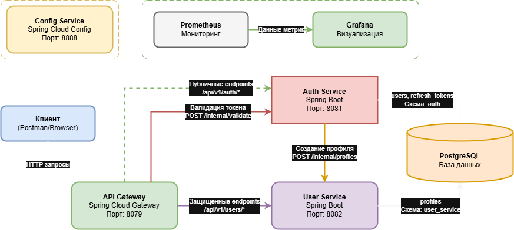

# Backend for frontends. Apigateway

##  Цель:
В этом ДЗ вы научитесь добавлять в приложение аутентификацию и регистрацию пользователей.


## Описание/Пошаговая инструкция выполнения домашнего задания:
Добавить в приложение аутентификацию и регистрацию пользователей.

Реализовать сценарий "Изменение и просмотр данных в профиле клиента".

Пользователь регистрируется. Заходит под собой и по определенному урлу получает данные о своем профиле. 
Может поменять данные в профиле. Данные профиля для чтения и редактирования не должны быть доступны другим клиентам (аутентифицированным или нет).

## На выходе должны быть предоставлена
1. описание архитектурного решения и схема взаимодействия сервисов (в виде картинки)
2. команда установки приложения (из helm-а или из манифестов). 
Обязательно указать в каком namespace нужно устанавливать.

В тестах обязательно
- наличие {{baseUrl}} для урла
- использование домена arch.homework в качестве initial значения {{baseUrl}}
- использование сгенерированных случайно данных в сценарии
- отображение данных запроса и данных ответа при запуске из командной строки с помощью newman.


# Описание решения

### Обзор системы
Система представляет собой микросервисную архитектуру, реализующую сценарий регистрации, аутентификации и управления профилем пользователя. Все сервисы написаны на Spring Boot и развернуты в Kubernetes.

### Компоненты системы

1. **API Gateway (api-gateway)** - Единая точка входа для всех клиентских запросов
    - Маршрутизация запросов к соответствующим сервисам
    - Валидация JWT токенов через auth-service
    - Добавление заголовков (X-Request-Id, X-User-Id)
    - Фильтрация и модификация запросов/ответов

2. **Config Service (config-service)** - Централизованное управление конфигурациями
    - Хранит конфигурации всех сервисов
    - Поддержка разных окружений
    - Обновление конфигураций без перезапуска сервисов

3. **Auth Service (auth-service)** - Сервис аутентификации и авторизации
    - Регистрация и аутентификация пользователей
    - Выпуск и валидация JWT токенов
    - Управление refresh токенами
    - Создание профиля пользователя в user-service

4. **User Service (user-service)** - Сервис управления профилями пользователей
    - Создание, чтение, обновление и деактивация профилей
    - Проверка прав доступа к профилям
    - Внутренние endpoint'ы для межсервисного взаимодействия

5. **PostgreSQL** - База данных
    - Раздельные схемы для auth и user сервисов
    - Использование Liquibase для миграций


``` bash
# открываем терминал в папке с проектом /HW06/helms  
cd helms

# Ставим helm через bash скрипт: deploy-service.sh
./deploy-service.sh {action} {service-name} {namespace}
    где action:
        install     - Установить чарт
        upgrade     - Обновить чарт (по умолчанию)
        uninstall   - Удалить релиз
        status      - Показать статус релиза
        list        - Список релизов в namespace
        history     - История релиза
        rollback    - Откатить релиз
        template    - Показать шаблоны
        
# Последовательность установки сервисов
./deploy-service.sh install postgres hw06
./deploy-service.sh install config-service hw06
./deploy-service.sh install auth-service hw06
./deploy-service.sh install user-service hw06
./deploy-service.sh install api-gateway hw06

# Альтернативно: быстрая установка всех компонентов
# Обязательно должен стартовать Config-service и Postgres, у остлньых будет 6 попыток на поиск конфигураций
for service in postgres config-service auth-service user-service api-gateway; do
    ./deploy-service.sh install $service hw06
    sleep 10  # Небольшая пауза между установками
done

# Альтернативно: быстрое обновление всех компонентов
# Обязательно должен стартовать Config-service и Postgres, у остлньых будет 6 попыток на поиск конфигураций
for service in postgres config-service auth-service user-service api-gateway; do
    ./deploy-service.sh upgrade $service hw06
    sleep 30  # Небольшая пауза между установками
done


#дожидаемся всех подов. Должно быть 3 пода сервиса, 1 под БД, 1 завершенный JOB 
$ kubectl get po -n hw06
    #kubectl.exe get po -n hw06 
    #NAME                                   READY   STATUS    RESTARTS        AGE
    #hw06-api-gateway-6b5b575679-qsgjd      1/1     Running   6 (3m48s ago)   15h
    #hw06-auth-service-597764d7df-g7vpp     1/1     Running   5 (6m13s ago)   15h
    #hw06-config-service-5f55649d55-hgfk7   1/1     Running   3 (5m56s ago)   15h
    #hw06-postgresql-0                      1/1     Running   2 (11m ago)     8d
    #hw06-user-service-55c66746db-l8zcj     1/1     Running   5 (6m29s ago)   15

#Запускаем тесты
$ cd .. 
newman run ./postman/otus-hw06.postman_collection.json

#Чистим за собой Chart
$ cd helms
for service in postgres config-service auth-service user-service api-gateway; do
    ./deploy-service.sh uninstall $service hw06
    sleep 1  # Небольшая пауза между установками
done

#Удаляем неймспейс
$ kubectl delete ns hw06

```