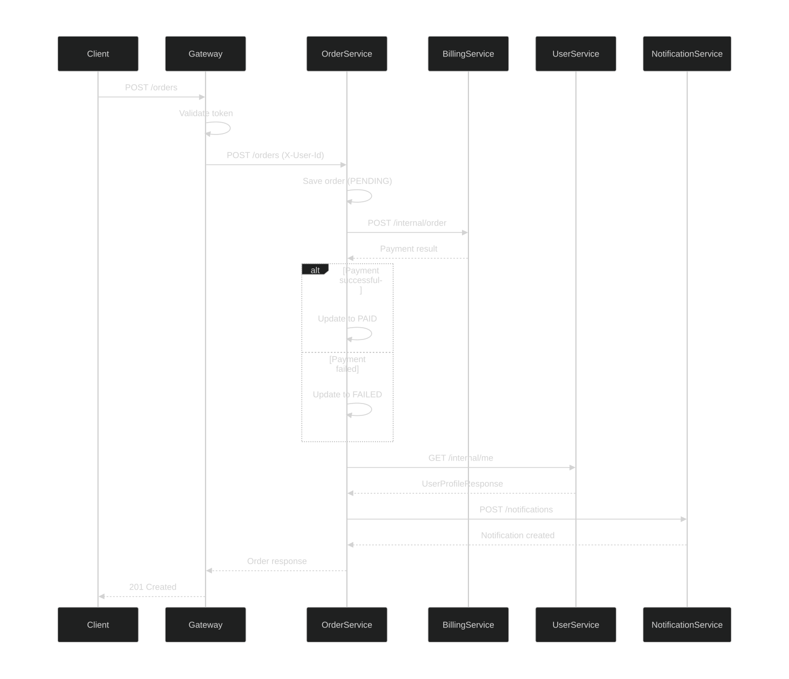
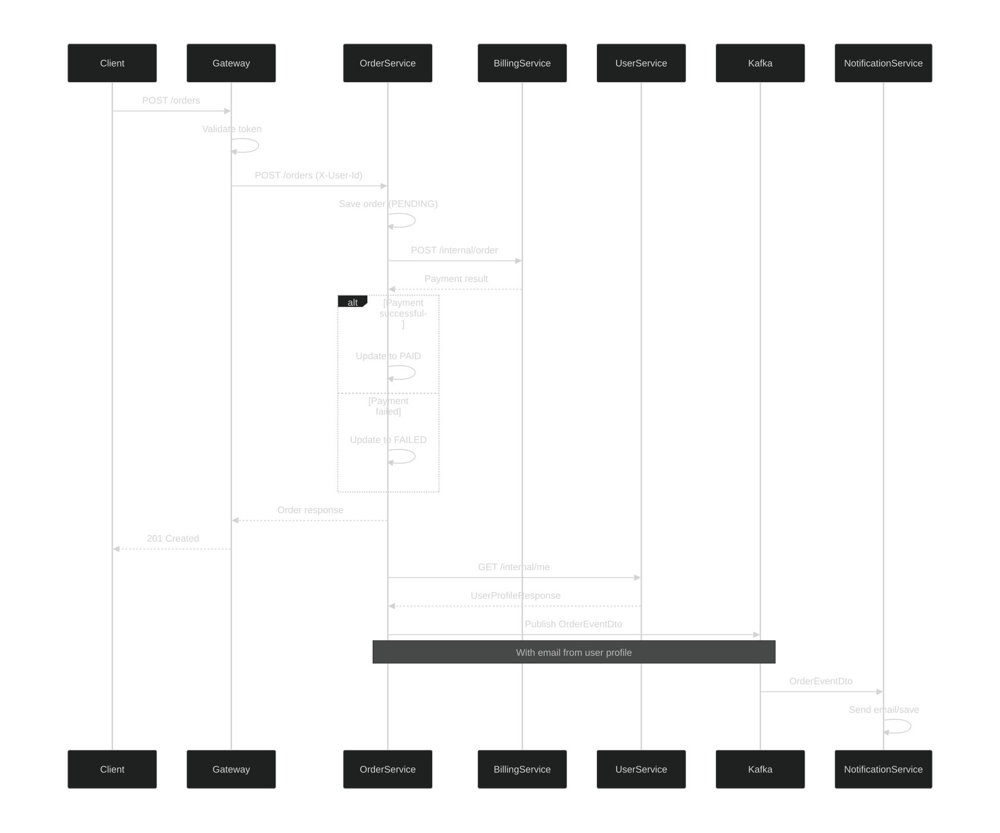
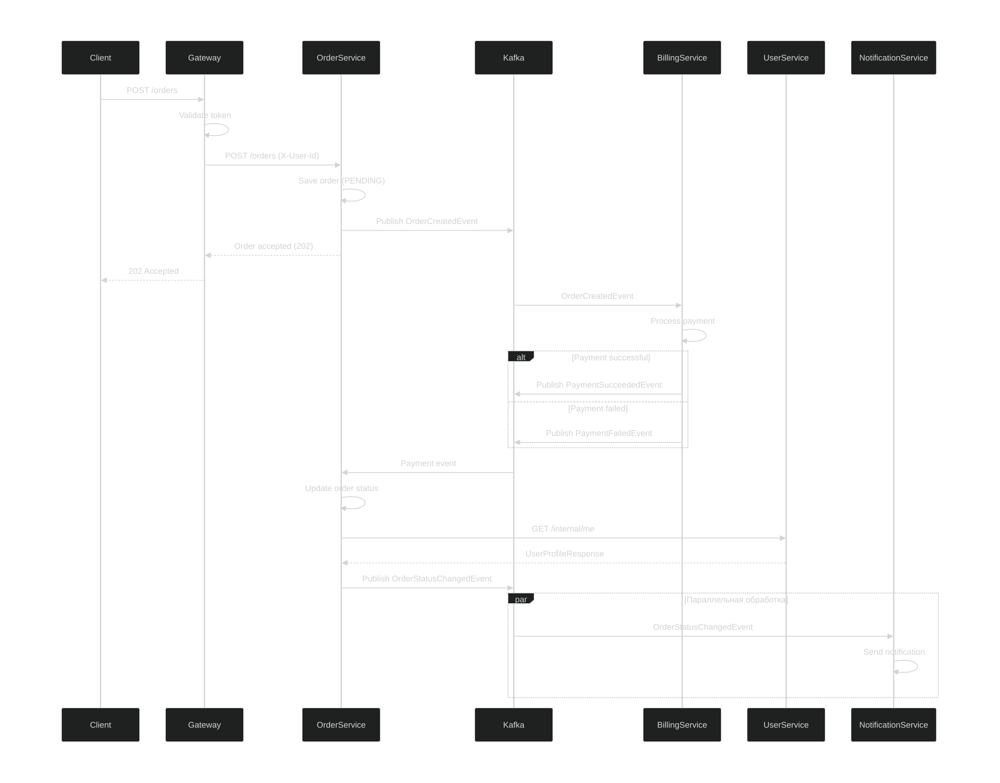
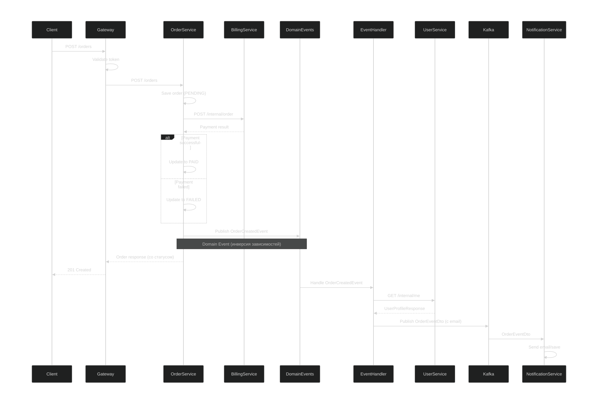

# ТЕОРЕТИЧЕСКАЯ ЧАСТЬ:

## Оглавление
- [Вариант 1: Только HTTP взаимодействие](#вариант-1-только-http-взаимодействие)
- [Вариант 2: Событийное взаимодействие с брокером сообщений](#вариант-2-событийное-взаимодействие-с-брокером-сообщений-для-нотификаций)
- [Вариант 3: Event Collaboration стиль взаимодействия](#вариант-3-event-collaboration-стиль-взаимодействия)
- [Вариант 4: Гибридный подход с Domain Events](#вариант-4-гибридный-подход-с-domain-events)

# Вариант 1: Только HTTP взаимодействие

## 1. Краткое описание процедуры взаимодействия

1. **Синхронный последовательный поток**:
    - Клиент → Gateway → Order Service (создание заказа)
    - Order Service → Billing Service (списание средств)
    - Order Service → User Service (получение профиля пользователя)
    - Order Service → Notification Service (создание уведомления)
    - Клиент получает ответ только после выполнения всех шагов

## 2. Sequence Diagram


## 3. API на IDL

### Order Service API:
```yaml
openapi: 3.1.0
paths:
  /orders:
    post:
      parameters:
        - name: X-User-Id
          in: header
          required: true
      requestBody:
        content:
          application/json:
            schema:
              $ref: '#/components/schemas/OrderCreateOrderRequest'
      responses:
        '201':
          content:
            application/json:
              schema:
                $ref: '#/components/schemas/OrderResponse'
```

### Billing Service API:
```yaml
openapi: 3.1.0
paths:
  /internal/order:
    post:
      parameters:
        - name: X-User-Id
          in: header
          required: true
      requestBody:
        content:
          application/json:
            schema:
              $ref: '#/components/schemas/BillingOrderRequest'
```

### User Service API:
```yaml
openapi: 3.1.0
paths:
  /internal/me:
    get:
      parameters:
        - name: X-User-Id
          in: header
          required: true
      responses:
        '200':
          content:
            application/json:
              schema:
                $ref: '#/components/schemas/UserProfileResponse'
```

### Notification Service API (добавляем endpoint):
```yaml
openapi: 3.1.0
paths:
  /notifications:
    post:
      parameters:
        - name: X-User-Id
          in: header
          required: true
      requestBody:
        content:
          application/json:
            schema:
              type: object
              properties:
                orderId:
                  type: string
                  format: uuid
                userId:
                  type: string
                  format: uuid
                email:
                  type: string
                  format: email
                status:
                  type: string
                  enum: [PAID, FAILED]
                price:
                  type: number
      responses:
        '201':
          description: Notification created
```

# Вариант 2: Событийное взаимодействие с брокером сообщений для нотификаций

## 1. Краткое описание процедуры взаимодействия

1. **Синхронный поток**:
    - Клиент → Gateway → Order Service (создание заказа)
    - Order Service → Billing Service (списание средств)
    - Order Service обновляет статус заказа
    - Клиент получает немедленный ответ

2. **Асинхронный поток**:
    - Order Service запрашивает User Service за профилем пользователя
    - Order Service публикует событие OrderEventDto в Kafka с email
    - Notification Service подписывается на события и отправляет email

## 2. Sequence Diagram


## 3. API на IDL

### Order Service API:
```yaml
openapi: 3.1.0
paths:
  /orders:
    post:
      parameters:
        - name: X-User-Id
          in: header
          required: true
      requestBody:
        content:
          application/json:
            schema:
              $ref: '#/components/schemas/OrderCreateOrderRequest'
      responses:
        '201':
          content:
            application/json:
              schema:
                $ref: '#/components/schemas/OrderResponse'
```

### Billing Service API:
```yaml
openapi: 3.1.0
paths:
  /internal/order:
    post:
      parameters:
        - name: X-User-Id
          in: header
          required: true
      requestBody:
        content:
          application/json:
            schema:
              $ref: '#/components/schemas/BillingOrderRequest'
```

### User Service API:
```yaml
openapi: 3.1.0
paths:
  /internal/me:
    get:
      parameters:
        - name: X-User-Id
          in: header
          required: true
      responses:
        '200':
          content:
            application/json:
              schema:
                $ref: '#/components/schemas/UserProfileResponse'
```

### AsyncAPI для событий:

#### Order Service:
```yaml
asyncapi: 3.0.0
channels:
  order.events:
    address: order.events
    messages:
      OrderEventDto:
        payload:
          type: object
          properties:
            orderId: {type: string, format: uuid}
            userId: {type: string, format: uuid}
            email: {type: string, format: email}
            price: {type: number}
            status: {type: string, enum: [PAID, FAILED, PENDING]}
            message: {type: string}
```

#### Notification Service:
```yaml
asyncapi: 3.0.0
channels:
  order.events:
    address: order.events
    messages:
      OrderEventDto:
        $ref: 'order-service-asyncapi.yaml#/channels/order.events/messages/OrderEventDto'
```


# Вариант 3: Event Collaboration стиль взаимодействия

## 1. Краткое описание процедуры взаимодействия

1. **Асинхронный event-driven поток**:
    - Все взаимодействия через брокер сообщений
    - Order Service публикует OrderCreated событие
    - Billing Service подписывается и обрабатывает платеж
    - Billing Service публикует PaymentProcessed событие
    - Order Service обновляет статус на основе события
    - User Service и Notification Service реагируют на финальные события

## 2. Sequence Diagram


## 3. API на IDL

### Синхронные API:

#### Order Service (только для приема команд):
```yaml
openapi: 3.1.0
paths:
  /orders:
    post:
      parameters:
        - name: X-User-Id
          in: header
          required: true
      responses:
        '202':
          description: Order accepted for processing
```

### AsyncAPI для Event Collaboration:

#### Order Service (публикует события):
```yaml
asyncapi: 3.0.0
channels:
  order.commands:
    address: order.commands
    messages:
      CreateOrderCommand:
        payload:
          type: object
          properties:
            orderId: {type: string, format: uuid}
            userId: {type: string, format: uuid}
            price: {type: number}
  
  order.events:
    address: order.events
    messages:
      OrderCreatedEvent:
        payload:
          type: object
          properties:
            orderId: {type: string, format: uuid}
            userId: {type: string, format: uuid}
            price: {type: number}
            status: {type: string, enum: [PENDING]}
      
      OrderStatusChangedEvent:
        payload:
          type: object
          properties:
            orderId: {type: string, format: uuid}
            userId: {type: string, format: uuid}
            email: {type: string, format: email}
            status: {type: string, enum: [PAID, FAILED]}
            price: {type: number}
```

#### Billing Service (подписывается и публикует):
```yaml
asyncapi: 3.0.0
channels:
  order.events:
    address: order.events
    messages:
      OrderCreatedEvent:
        $ref: 'order-service-asyncapi.yaml#/channels/order.events/messages/OrderCreatedEvent'
  
  payment.events:
    address: payment.events
    messages:
      PaymentSucceededEvent:
        payload:
          type: object
          properties:
            orderId: {type: string, format: uuid}
            userId: {type: string, format: uuid}
            amount: {type: number}
      
      PaymentFailedEvent:
        payload:
          type: object
          properties:
            orderId: {type: string, format: uuid}
            userId: {type: string, format: uuid}
            amount: {type: number}
            reason: {type: string}
```

#### Notification Service (подписывается):
```yaml
asyncapi: 3.0.0
channels:
  order.events:
    address: order.events
    messages:
      OrderStatusChangedEvent:
        $ref: 'order-service-asyncapi.yaml#/channels/order.events/messages/OrderStatusChangedEvent'
```

#### User Service (только REST, без событий):
```yaml
openapi: 3.1.0
paths:
  /internal/me:
    get:
      parameters:
        - name: X-User-Id
          in: header
          required: true
```


# Вариант 4: Гибридный подход с Domain Events

## 1. Краткое описание процедуры взаимодействия


1. **Синхронный поток**:
    - Клиент → Gateway → Order Service
    - Order Service → Billing Service (синхронный платеж)
    - Order Service обновляет статус заказа
    - Клиент сразу получает финальный статус оплаты

2. **Асинхронный поток (Domain Events)**:
    - Order Service публикует Domain Event через ApplicationEventPublisher
    - Event handler запрашивает User Service за профилем
    - Event handler публикует в Kafka
    - Notification Service обрабатывает событие и отправляет email


## 2. Сравнение с другими вариантами

### **По сравнению с Вариантом 1 (только HTTP)**:
**Плюсы гибридного варианта:**
- Быстрый ответ клиенту (не ждем нотификации)
- Масштабируемость нотификаций
- Отказоустойчивость через Kafka
- Можно добавить новых потребителей событий

**Плюсы варианта 1 (только HTTP):**
- Нет Kafka инфраструктуры
- Проще отладка (один поток)
- Проще развертывание

### **По сравнению с Вариантом 2 (нотификации через брокер)**:
**Плюсы гибридного варианта:**
- **Domain Events** вместо прямого вызова Kafka
- Инверсия зависимостей (можно заменить Kafka на другую реализацию)
- Чистая бизнес-логика без инфраструктурных деталей
- Легче тестировать (можно mock'ать ApplicationEventPublisher)

**Плюсы варианта 2 (нотификации через брокер):**
- Меньше слоев абстракции
- Прямая публикация в Kafka

### **По сравнению с Вариантом 3 (Event Collaboration)**:
**Плюсы гибридного варианта:**
- Клиент сразу получает статус платежа (нет eventual consistency)
- Проще трассировка (синхронная цепочка для платежей)
- Меньше сложности (нет распределенных транзакций)
- Более предсказуемая система

**Плюсы варианта 3 (Event Collaboration):**
- Полная декомпозиция сервисов
- Лучшая горизонтальная масштабируемость
- Более гибкая оркестрация процессов


## 3. Sequence Diagram


## 4. API на IDL

### Синхронные API (как есть):

#### Order Service:
```yaml
openapi: 3.1.0
paths:
  /orders:
    post:
      parameters:
        - name: X-User-Id
          in: header
          required: true
      responses:
        '201':
          content:
            application/json:
              schema:
                $ref: '#/components/schemas/OrderResponse'
```

#### Billing Service:
```yaml
openapi: 3.1.0
paths:
  /internal/order:
    post:
      parameters:
        - name: X-User-Id
          in: header
          required: true
```

#### User Service:
```yaml
openapi: 3.1.0
paths:
  /internal/me:
    get:
      parameters:
        - name: X-User-Id
          in: header
          required: true
```

### AsyncAPI для Kafka событий:

```yaml
asyncapi: 3.0.0
channels:
  order.events:
    address: order.events
    messages:
      OrderEventDto:
        payload:
          type: object
          properties:
            orderId: {type: string, format: uuid}
            userId: {type: string, format: uuid}
            email: {type: string, format: email}
            price: {type: number}
            status: {type: string, enum: [PAID, FAILED]}
```
