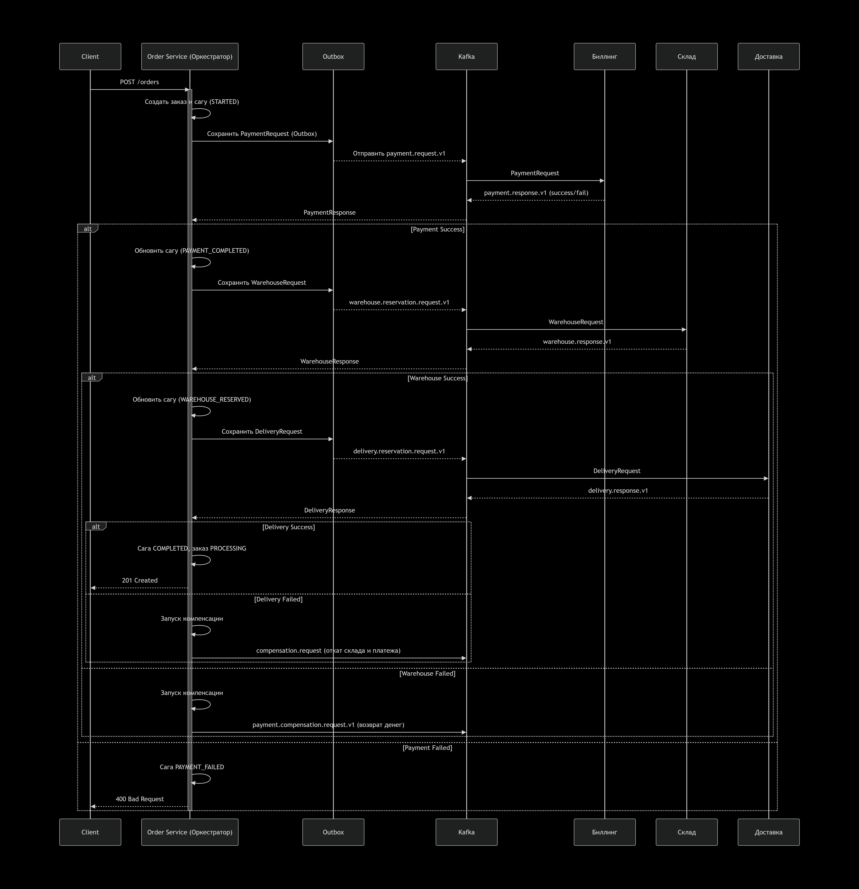

# Распределенные транзакции

## Постновка задачи:
 
### Цель:
В этом ДЗ вы научитесь реализовывать распределенную транзакцию.


### Описание/Пошаговая инструкция выполнения домашнего задания:
Сценарий для интернет-магазина:
Реализовать сервисы "Биллинг", "Склад", "Доставка".

Для сервиса "Заказ", в рамках метода "создание заказа" реализовать механизм распределенной транзакции (на основе Саги или двухфазного коммита).
Во время создания заказа необходимо:
1. в сервисе "Биллинг" убедиться, что платеж прошел
2. в сервисе "Склад" зарезервировать конкретный товар на складе
3. в сервисе "Доставка" зарезервировать курьера на конкретный слот времени.

Если хотя бы один из пунктов не получилось сделать, необходимо откатить все остальные изменения.
На выходе должно быть:
0) описание того, какой паттерн для реализации распределенной транзакции использовался
1) команда установки приложения (из helm-а или из манифестов). Обязательно указать в каком namespace нужно устанавливать и команду создания namespace, если это важно для сервиса.
2) тесты в postman

В тестах обязательно
- использование домена arch.homework в качестве initial значения {{baseUrl}}

# Описание решения

### Обзор системы
Для реализации распределенной транзакции создания заказа с участием сервисов Биллинг, 
Склад и Доставка используется комбинация двух ключевых паттернов: Saga (Оркестратор) и Transactional Outbox.
### Компоненты системы
### **1. Компоненты оркестратора**

| Компонент | Назначение |
|-----------|------------|
| `OrderSagaOrchestrator` | Главный координатор, слушает ответы из Kafka |
| `SagaStateMachine` | Управляет переходами между состояниями саги |
| `SagaStepHandler` (Payment, Warehouse, Delivery) | Инкапсулирует логику каждого шага |
| `SagaCompensationExecutor` | Запускает компенсации в обратном порядке |
| `SagaRecoveryService` | Восстанавливает "зависшие" саги по таймауту |
| `OutboxService` | Сохраняет события в БД перед отправкой в Kafka |

---

### **2. States саги (`OrderSaga.SagaState`)**

```java
// Основные состояния
STARTED → PAYMENT_PROCESSING → PAYMENT_COMPLETED → 
WAREHOUSE_RESERVING → WAREHOUSE_RESERVED → 
DELIVERY_RESERVING → DELIVERY_RESERVED → COMPLETED

// Состояния ошибок
PAYMENT_FAILED → COMPENSATING → COMPENSATED
WAREHOUSE_FAILED → COMPENSATING → COMPENSATED
DELIVERY_FAILED → COMPENSATING → COMPENSATED
```



## Результаты тестов:


## Скрипты:
``` bash
# открываем терминал в папке с проектом /hw08/helms  
cd helms


# Быстрая установка всех компонентов
# Обязательно должен стартовать Config-service и Postgres, у остлньых будет 6 попыток на поиск конфигураций
services=(
    auth-service
    user-service
    billing-service
    notification-service
    order-service
    warehouse-service
    delivery-service
    api-gateway
)
for service in postgres config-service ; do
    ./deploy-service.sh install $service hw08
done
sleep 30 # Даем немного времени для постгре и конфиг сервера
for service in "${services[@]}"; do
    ./deploy-service.sh install $service hw08
    sleep 45  # Небольшая пауза между установками
done

# Быстрое обновление всех компонентов
# Обязательно должен стартовать Config-service и Postgres, у остлньых будет 6 попыток на поиск 
services=(
    auth-service
    user-service
    billing-service
    notification-service
    order-service
    warehouse-service
    delivery-service
    api-gateway
)
for service in postgres config-service ; do
    ./deploy-service.sh upgrade $service hw08
done
sleep 30 # Даем немного времени для постгре и конфиг сервера
for service in "${services[@]}"; do
    ./deploy-service.sh upgrade $service hw08
    sleep 45  # Небольшая пауза между установками
done


# Ставим helm через bash скрипт: deploy-service.sh
./deploy-service.sh {action} {service-name} {namespace}
    где action:
        install     - Установить чарт
        upgrade     - Обновить чарт (по умолчанию)
        uninstall   - Удалить релиз
        status      - Показать статус релиза
        list        - Список релизов в namespace
        history     - История релиза
        rollback    - Откатить релиз
        template    - Показать шаблоны
        
# Последовательность установки сервисов
./deploy-service.sh install postgres hw08
./deploy-service.sh install config-service hw08
./deploy-service.sh install auth-service hw08
./deploy-service.sh install user-service hw08
./deploy-service.sh install billing-service hw08
./deploy-service.sh install notification-service hw08
./deploy-service.sh install order-service hw08
./deploy-service.sh install warehouse-service hw08
./deploy-service.sh install delivery-service hw08
./deploy-service.sh install api-gateway hw08


#дожидаемся всех подов. Должно быть 3 пода сервиса, 1 под БД, 1 завершенный JOB 
$ kubectl get po -n hw08
    #kubectl.exe get po -n hw08 
    #NAME                                   READY   STATUS    RESTARTS        AGE
    #hw08-api-gateway-6b5b575679-qsgjd      1/1     Running   6 (3m48s ago)   15h
    #hw08-auth-service-597764d7df-g7vpp     1/1     Running   5 (6m13s ago)   15h
    #hw08-config-service-5f55649d55-hgfk7   1/1     Running   3 (5m56s ago)   15h
    #hw08-postgresql-0                      1/1     Running   2 (11m ago)     8d
    #hw08-user-service-55c66746db-l8zcj     1/1     Running   5 (6m29s ago)   15

#Запускаем тесты
$ newman run ../postman/otus-hw08.postman_collection.json
 
#Чистим за собой Chart
$ for service in postgres config-service auth-service user-service api-gateway; do
    ./deploy-service.sh uninstall $service hw08
    sleep 1  # Небольшая пауза между установками
done
  
#Удаляем неймспейс
$ kubectl delete ns hw08

```