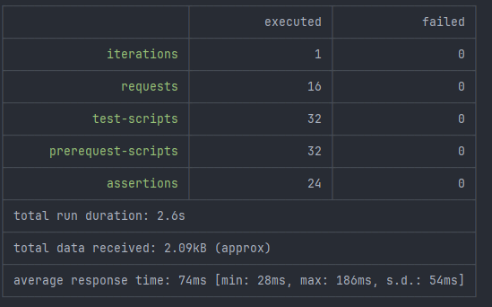

# Stream processing

## Постновка задачи:
 
### Цель:
В этом ДЗ вы научитесь реализовывать сервис заказа.


### Описание/Пошаговая инструкция выполнения домашнего задания:
Реализовать сервис заказа. Сервис биллинга. Сервис нотификаций.

При создании пользователя, необходимо создавать аккаунт в сервисе биллинга. 
В сервисе биллинга должна быть возможность положить деньги на аккаунт и снять деньги.

Сервис нотификаций позволяет отправить сообщение на email. 
И позволяет получить список сообщений по методу API.

Пользователь может создать заказ. У заказа есть параметр - цена заказа.

Заказ происходит в 2 этапа:
1. Cначала снимаем деньги с пользователя с помощью сервиса биллинга
2. Отправляем пользователю сообщение на почту с результатами оформления заказа. 
Если биллинг подтвердил платеж, должно отправиться письмо счастья. Если нет, то письмо горя.

Упрощаем и считаем, что ничего плохого с сервисами происходить не может (они не могут падать и т.д.). 
Сервис нотификаций на самом деле не отправляет, а просто сохраняет в БД.


### ТЕОРЕТИЧЕСКАЯ ЧАСТЬ:
Спроектировать взаимодействие сервисов при создании заказов. 
Предоставить варианты взаимодействий в следующих стилях в виде sequence диаграммы с описанием API на IDL:

1. только HTTP взаимодействие
2. событийное взаимодействие с использование брокера сообщений для нотификаций (уведомлений)
3. Event Collaboration cтиль взаимодействия с использованием брокера сообщений
4. вариант, который вам кажется наиболее адекватным для решения данной задачи. 
Если он совпадает одним из вариантов выше - просто отметить это.

### ПРАКТИЧЕСКАЯ ЧАСТЬ:
Выбрать один из вариантов и реализовать его.
На выходе должны быть
1. описание архитектурного решения и схема взаимодействия сервисов (в виде картинки)
2. команда установки приложения (из helm-а или из манифестов). 
Обязательно указать в каком namespace нужно устанавливать.
3. тесты постмана, которые прогоняют сценарий:
   - Создать пользователя. Должен создаться аккаунт в биллинге.
   - Положить деньги на счет пользователя через сервис биллинга.
   - Сделать заказ, на который хватает денег.
   - Посмотреть деньги на счету пользователя и убедиться, что их сняли.
   - Посмотреть в сервисе нотификаций отправленные сообщения и убедиться, что сообщение отправилось
   - Сделать заказ, на который не хватает денег.
   - Посмотреть деньги на счету пользователя и убедиться, что их количество не поменялось.
   - Посмотреть в сервисе нотификаций отправленные сообщения и убедиться, что сообщение отправилось.

В тестах обязательно
- наличие {{baseUrl}} для урла
- использование домена arch.homework в качестве initial значения {{baseUrl}}
- отображение данных запроса и данных ответа при запуске из командной строки с помощью newman.

# Описание решения

### Обзор системы
Система реализует сценарий создания и обработки заказов в микросервисной архитектуре. 
Основные сервисы взаимодействуют через HTTP API и асинхронные сообщения с использованием Kafka.

### Компоненты системы

1. **API Gateway** - Единая точка входа
    - Маршрутизация запросов к сервисам
    - Валидация JWT токенов через auth-service
    - Добавление заголовков для трассировки

2. **Order Service** - Сервис управления заказами
    - Создание заказов (со статусом PENDING)
    - Синхронное взаимодействие с Billing Service для списания средств
    - Публикация событий о создании заказа
    - Управление статусами заказов (PAID/FAILED)

3. **Billing Service** - Сервис биллинга
    - Управление балансом пользователей
    - Операции списания и пополнения средств
    - Создание счетов при регистрации новых пользователей 

4. **Notification Service** - Сервис уведомлений
    - Обработка событий о заказах из Kafka
    - Отправка email-уведомлений пользователям
    - Сохранение истории уведомлений

5. **User Service** - Сервис управления профилями
    - Хранение профилей пользователей
    - Предоставление данных профилей для других сервисов

6. **Auth Service** - Сервис аутентификации
    - Регистрация и аутентификация пользователей
    - Выпуск и валидация JWT токенов
    - Публикация событий о создании пользователей (Kafka)

7. **Config Service (config-service)** - Централизованное управление конфигурациями
    - Хранит конфигурации всех сервисов
    - Поддержка разных окружений
    - Обновление конфигураций без перезапуска сервисов

### Технологический стек
- Spring Boot (все сервисы)
- Spring Cloud Gateway (API Gateway)
- PostgreSQL (основная БД)
- Kafka (брокер сообщений для асинхронной коммуникации)
- Kubernetes (оркестрация и развертывание)
- OpenAPI/AsyncAPI (документирование API)

### Основной поток создания заказа
1. Клиентский запрос → API Gateway (проверка токена) → Order Service
2. Order Service создает заказ со статусом PENDING
3. Синхронный вызов Billing Service для списания средств
4. Обновление статуса заказа (PAID/FAILED) на основе результата оплаты
5. Публикация события в Kafka с деталями заказа
6. Notification Service обрабатывает событие и отправляет уведомление пользователю

## C4 модель


## Результаты тестов:


## Скрипты:
``` bash
# открываем терминал в папке с проектом /hw08/helms  
cd helms


# Быстрая установка всех компонентов
# Обязательно должен стартовать Config-service и Postgres, у остлньых будет 6 попыток на поиск конфигураций
services=(
    auth-service
    user-service
    billing-service
    notification-service
    order-service
    warehouse-service
    delivery-service
    api-gateway
)
for service in postgres config-service ; do
    ./deploy-service.sh install $service hw08
done
sleep 30 # Даем немного времени для постгре и конфиг сервера
for service in "${services[@]}"; do
    ./deploy-service.sh install $service hw08
    sleep 15  # Небольшая пауза между установками
done

# Быстрое обновление всех компонентов
# Обязательно должен стартовать Config-service и Postgres, у остлньых будет 6 попыток на поиск 
services=(
    auth-service
    user-service
    billing-service
    notification-service
    order-service
    warehouse-service
    delivery-service
    api-gateway
)
for service in postgres config-service ; do
    ./deploy-service.sh upgrade $service hw08
done
sleep 30 # Даем немного времени для постгре и конфиг сервера
for service in "${services[@]}"; do
    ./deploy-service.sh upgrade $service hw08
    sleep 15  # Небольшая пауза между установками
done


# Ставим helm через bash скрипт: deploy-service.sh
./deploy-service.sh {action} {service-name} {namespace}
    где action:
        install     - Установить чарт
        upgrade     - Обновить чарт (по умолчанию)
        uninstall   - Удалить релиз
        status      - Показать статус релиза
        list        - Список релизов в namespace
        history     - История релиза
        rollback    - Откатить релиз
        template    - Показать шаблоны
        
# Последовательность установки сервисов
./deploy-service.sh install postgres hw08
./deploy-service.sh install config-service hw08
./deploy-service.sh install auth-service hw08
./deploy-service.sh install user-service hw08
./deploy-service.sh install billing-service hw08
./deploy-service.sh install notification-service hw08
./deploy-service.sh install order-service hw08
./deploy-service.sh install warehouse-service hw08
./deploy-service.sh install delivery-service hw08
./deploy-service.sh install api-gateway hw08


#дожидаемся всех подов. Должно быть 3 пода сервиса, 1 под БД, 1 завершенный JOB 
$ kubectl get po -n hw08
    #kubectl.exe get po -n hw08 
    #NAME                                   READY   STATUS    RESTARTS        AGE
    #hw08-api-gateway-6b5b575679-qsgjd      1/1     Running   6 (3m48s ago)   15h
    #hw08-auth-service-597764d7df-g7vpp     1/1     Running   5 (6m13s ago)   15h
    #hw08-config-service-5f55649d55-hgfk7   1/1     Running   3 (5m56s ago)   15h
    #hw08-postgresql-0                      1/1     Running   2 (11m ago)     8d
    #hw08-user-service-55c66746db-l8zcj     1/1     Running   5 (6m29s ago)   15

#Запускаем тесты
$ newman run ../postman/otus-hw08.postman_collection.json
 
#Чистим за собой Chart
$ for service in postgres config-service auth-service user-service api-gateway; do
    ./deploy-service.sh uninstall $service hw08
    sleep 1  # Небольшая пауза между установками
done
  
#Удаляем неймспейс
$ kubectl delete ns hw08

```